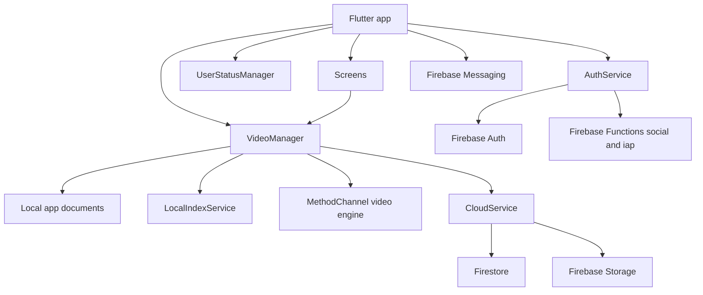

# ARCHITECTURE.md

## 1. 시스템 개요

## 2. 디렉터리 역할

- `lib/screens`: UI 화면. 촬영, 라이브러리, 프로젝트, 클라우드 백업, 로그인, 결제, 프로필 화면을 포함합니다.
- `lib/managers`: 앱 상태와 도메인 조정. `VideoManager`, `UserStatusManager`가 핵심입니다.
- `lib/services`: Firebase, Auth, IAP, Cloud, 로컬 인덱스, 알림, 동기화 큐 처리.
- `lib/models`: Vlog 프로젝트, 가져오기 상태, 클립 저장 작업 등 데이터 모델.
- `lib/utils`: 품질 정책, 에러 카피, 미디어 선택, 햅틱 등 보조 로직.
- `lib/widgets`: 재사용 UI 컴포넌트.
- `firebase`: Firestore/Storage 규칙과 인덱스.
- `functions`: Firebase Functions social exchange와 IAP verify.
- `plans`: 계획, 릴리스 체크리스트, 의사결정 기록.
- `benchmark`: 디자인/품질 기준 자료.
- `tools`: Android QA와 benchmark 보조 스크립트.

## 3. 앱 초기화 흐름

1. `lib/main.dart`에서 WidgetsBinding, Kakao SDK, Firebase, FCM background handler, System UI, 카메라 목록을 초기화합니다.
2. `MyApp`은 `VideoManager`, `UserStatusManager`, `IAPService`를 Provider로 주입합니다.
3. `AuthGate`는 Firebase Auth 상태와 게스트 모드를 기준으로 `LoginScreen` 또는 `MainNavigationScreen`을 표시합니다.
4. `MainNavigationScreen`은 FCM 라우팅, 튜토리얼, 클라우드 업로드 큐 복구, VideoManager 데이터 로드를 조정합니다.

## 4. 주요 사용자 흐름

### 촬영과 저장

1. `CaptureScreen`이 카메라와 품질/비율 설정을 다룹니다.
2. `VideoManager`가 네이티브 `MethodChannel('com.dk.three_sec/video_engine')`로 영상 처리 엔진을 호출합니다.
3. 클립은 앱 문서 디렉터리 하위 `vlogs/raw_clips/{album}` 계열에 저장됩니다.
4. duration, ownership, cloud synced 상태는 SharedPreferences 메타데이터로 보조 저장됩니다.

### 라이브러리와 프로젝트

1. `LibraryScreen`은 현재 clip album의 클립 목록과 선택 상태를 표시합니다.
2. `ProjectScreen`/`VlogScreen`은 Vlog 프로젝트 목록과 상세를 표시합니다.
3. `VideoManager.createProject`가 클립 duration과 timeline thumbnail을 준비하고 `VlogProject` JSON을 저장합니다.
4. 프로젝트 JSON은 앱 문서 디렉터리의 `vlog_projects` 및 `vlogs/vlog_projects` 계열 호환 경로와 연결됩니다.

### 내보내기

1. 편집 화면에서 clip start/end, audioConfig, bgm, quality를 구성합니다.
2. `VideoManager.exportVlog`가 권한, 품질 tier 제한, 메모리 압박, 중복/누락 audioConfig를 점검합니다.
3. 네이티브 video engine이 병합하고 결과를 `Vlogs/vlog_{timestamp}.mp4` 계열로 저장합니다.
4. 실패는 `ASSET_LOADER`, `ENCODER_ERROR`, `EXTERNAL_FORCE_STOP`, `UNKNOWN` 등으로 정규화됩니다.

### 클라우드 백업

1. `CloudBackupScreen`과 `CloudService`가 업로드/다운로드/삭제를 담당합니다.
2. 게스트는 클라우드 작업이 차단됩니다.
3. Standard 이상만 클라우드 업로드가 허용됩니다.
4. Firestore `videos` 문서와 Storage `users/{uid}/videos/{videoId}/{fileName}` 객체가 연결됩니다.
5. 업로드 큐는 `SyncQueueStore`를 통해 로컬에 저장되고 앱 복귀 시 복구됩니다.

## 5. 외부 서비스 연동

- Firebase Auth: 이메일/소셜/게스트 게이트와 uid 기준 데이터 분리.
- Firestore: `users`, `videos`, `vlog_projects`, `users/{uid}/usageEvents`.
- Firebase Storage: 사용자 영상과 프로필 이미지 저장.
- Firebase Messaging: FCM 권한, topic 설정, notification route queue.
- Firebase Functions: Kakao/Naver social token exchange, IAP verify.
- Kakao/Naver/Apple/Google login SDK: 소셜 로그인.
- In-app purchase: `3s_*` product id 기반 구독 tier.
- Android Native Media3/MethodChannel: 영상 변환, 추출, 병합.

## 6. 위험한 구조 지점

- `lib/main.dart`: 초기화, AuthGate, FCM, 튜토리얼, 네이티브 채널이 결합된 고위험 파일.
- `lib/managers/video_manager.dart`: 로컬 파일 저장/삭제, 프로젝트 JSON, 클립 상태, 내보내기, 동기화 메타데이터를 포함합니다.
- `lib/services/cloud_service.dart`: Firestore/Storage write/delete, purge, usage accounting, 업로드 큐를 포함합니다.
- `functions/index.js`: social token, custom token, IAP product validation을 포함합니다.
- `android/app/build.gradle.kts`: 앱 식별자, release signing, R8/shrink 설정을 포함합니다.
