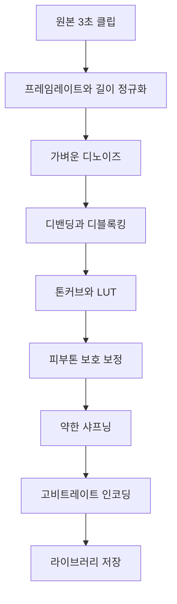

# 카메라 예쁜 영상 화질 리서치/분석 v1

## 1. 목적과 현재 맥락

사용자가 느끼는 문제는 현재 카메라가 원본을 거의 그대로 저장해, 최종 영상에서 다음 가치가 부족하게 보인다는 점이다.

- 화면이 미세하게 흔들리거나 압축으로 뭉개져 보이는 **우글우글함**
- 아이폰 기본 카메라처럼 이미 촬영 결과 자체가 예쁘게 보이는 **감성적 톤**
- 짧은 브이로그 앱에서 고객을 즉시 사로잡는 **완성도 높은 기본 결과물**

현재 프로젝트는 Flutter 기반 영상/브이로그 앱이며, 카메라 촬영 화면은 [`lib/screens/capture_screen.dart`](../lib/screens/capture_screen.dart), 품질 정책은 [`lib/utils/quality_policy.dart`](../lib/utils/quality_policy.dart), Android 네이티브 영상 처리/정규화는 [`android/app/src/main/kotlin/com/dk/three_sec/MainActivity.kt`](../android/app/src/main/kotlin/com/dk/three_sec/MainActivity.kt), iOS 네이티브 병합/정규화는 [`ios/Runner/AppDelegate.swift`](../ios/Runner/AppDelegate.swift)에 있다.

기존 문서 기준으로는 다음 방향성이 이미 잡혀 있다.

- 카메라 디자인/UX 기준: [`benchmark/Design_Spec_Camera_v1.md`](../benchmark/Design_Spec_Camera_v1.md)
- 카메라 초기화/네이티브 카메라 분석: [`plans/camera_startup_speed_and_native_camera_app_analysis_v1.md`](camera_startup_speed_and_native_camera_app_analysis_v1.md)
- 기본 촬영 1080p, 4K는 지원 기기/프리미엄 중심 정책: [`plans/pixel_quality_policy_rollout_plan_v1.md`](pixel_quality_policy_rollout_plan_v1.md)

이 문서는 코드 수정 없이, **최종 촬영 영상 자체를 예쁘게 만드는 실제 적용 가능 기술**을 촬영 시점, 실시간 필터, 후처리 파이프라인, 네이티브 구현 옵션, 제품 전략으로 나누어 분석한다.

---

## 2. 결론 요약

3초 클립 앱에서 체감이 가장 큰 화질 개선은 단순히 4K로 올리는 것이 아니라, 아래 순서로 **소스 품질 안정화 + 룩 프리셋 + 짧은 클립 전용 후처리**를 결합하는 것이다.

| 우선순위 | 추천 액션 | 기대 효과 | 구현 부담 | 주요 리스크 |
|---|---|---:|---:|---|
| P0 | 1080p 촬영 기본값 고정, 녹화/정규화 비트레이트 상향, H.264 품질 프로파일 정리 | 압축 뭉개짐과 디테일 손실 즉시 완화 | 낮음 | 파일 크기 증가 |
| P0 | AE/AWB/AF 안정화 정책 도입: 녹화 직전 노출·화이트밸런스·포커스 수렴 후 락 또는 완만 추적 | 3초 클립의 깜빡임·색 흔들림 감소 | 중간 | 플러그인 한계 |
| P1 | 브랜드 기본 LUT/톤커브 적용: 따뜻한 화이트, 부드러운 대비, 하이라이트 롤오프, 피부톤 보호 | 아이폰 감성에 가까운 즉시 예쁜 결과 | 중간 | 과보정/취향 편차 |
| P1 | 촬영 후 3초 클립 전용 후처리: 가벼운 디노이즈, 디밴딩, 디블록킹, 약한 샤프닝, 최종 고비트레이트 인코딩 | 우글우글함·압축 아티팩트 완화 | 중간~높음 | 처리 시간/발열 |
| P2 | Android CameraX/Camera2, iOS AVFoundation 커스텀 촬영 경로 구축 | 비트레이트, HDR, 안정화, 노출 제어 고도화 | 높음 | 단말 호환성 |
| P3 | ML 기반 저조도/슈퍼레졸루션/세그먼트 피부톤 보정 | 차별화된 프리미엄 품질 | 매우 높음 | 성능/모델 용량 |

핵심 제품 전략은 사용자가 화질 설정을 이해하게 만드는 것이 아니라, **Daily Life, Warm Film, Clean Night, Soft Skin 같은 룩 프리셋**으로 패키징해 기본 촬영 결과가 자동으로 예뻐 보이게 만드는 것이다.

---

## 3. 사용자가 말한 우글우글함의 가능한 원인

사용자가 말한 우글우글함은 하나의 문제가 아니라, 촬영·프리뷰·인코딩·후처리 단계가 합쳐져 발생하는 체감 품질 저하일 가능성이 높다.

### 3.1 저비트레이트와 인코딩 아티팩트

비트레이트가 낮으면 잔디, 머리카락, 벽지, 옷감, 야간 노이즈처럼 고주파 디테일이 많은 영역에서 블록/모기 노이즈가 생긴다. 화면이 정지해도 미세하게 끓는 듯한 질감이 나타나며, 사용자는 이를 우글우글하다고 느낀다.

현재 Android 네이티브에는 4K 20Mbps, 1080p 5Mbps 상수가 보인다. [`BITRATE_4K_MAX`](../android/app/src/main/kotlin/com/dk/three_sec/MainActivity.kt:375), [`BITRATE_1080P_MAX`](../android/app/src/main/kotlin/com/dk/three_sec/MainActivity.kt:376). 1080p 5Mbps는 짧은 SNS 공유용으로는 가능하지만, 필터/크롭/재인코딩이 들어가면 원본 디테일 보존에는 부족할 수 있다.

**권장 방향**

- 1080p 최종 저장: 일반 장면 8~12Mbps, 움직임/야간/디테일 많은 장면 12~16Mbps 검토
- 4K 최종 저장: 35~60Mbps까지 단계적 검토
- 3초 클립은 파일 길이가 짧으므로, 일반 긴 영상보다 비트레이트를 더 공격적으로 높여도 파일 크기 부담이 상대적으로 작다.

### 3.2 센서 노이즈와 노이즈 리덕션 실패

야간/실내에서는 센서 노이즈가 증가한다. 카메라 ISP가 강하게 노이즈 리덕션을 걸면 피부와 디테일이 밀가루처럼 뭉개지고, 약하게 걸면 압축기가 노이즈를 디테일로 착각해 비트레이트를 낭비한다. 둘 다 최종 영상에서는 우글우글한 질감으로 보인다.

**권장 방향**

- 촬영 시점: ISO를 과도하게 올리지 않도록 노출 보정/셔터/FPS 정책 관리
- 후처리: 약한 temporal denoise 또는 spatial denoise를 적용하고, 이후 약한 edge-aware sharpening 적용
- 저조도 룩은 선명도보다 노이즈 안정감을 우선한다.

### 3.3 샤프닝과 노이즈 리덕션의 균형 실패

과도한 샤프닝은 머리카락/피부/텍스트 주변에 링잉을 만들고, 압축 시 모기 노이즈를 키운다. 반대로 디노이즈만 강하면 영상이 플라스틱처럼 보인다.

**권장 방향**

- 디노이즈 → 디밴딩/디블록킹 → 약한 샤프닝 순서
- 샤프닝은 전체 프레임이 아니라 중간 주파수/경계에 제한
- 피부톤 영역은 샤프닝 강도를 낮추고, 배경 텍스처는 적당히 유지

### 3.4 롤링셔터와 안정화 보정 부산물

스마트폰 CMOS 센서는 빠른 팬/걷기/손떨림에서 세로선이 휘거나 젤리처럼 출렁이는 롤링셔터가 생긴다. EIS가 이를 보정하는 과정에서 프레임 가장자리 크롭, 워핑, 미세한 흔들림 보정 흔적이 생기면 화면이 물결처럼 보일 수 있다.

**권장 방향**

- 3초 클립에서는 과한 디지털 안정화보다 짧은 구간의 자연스러운 안정감이 중요
- 손떨림 보정은 켜되, 저가 Android에서 EIS 부산물이 큰 경우 강도를 낮추거나 후처리 보정으로 대체
- 움직임이 큰 장면에서는 60fps 촬영 후 30fps 출력 옵션을 검토하되, 저조도에서는 30fps가 더 유리할 수 있다.

### 3.5 프레임 보간/프레임레이트 불일치

촬영은 30fps인데 후처리/병합/타임라인이 다른 fps로 재인코딩되면 judder, 중복 프레임, 미세 떨림이 발생한다. 짧은 클립에서는 1~2프레임 문제도 눈에 잘 띈다.

**권장 방향**

- 촬영 fps, 편집 타임라인 fps, export fps를 30fps 중심으로 고정
- 60fps는 별도 모드로만 제공하고, 최종 30fps 변환 시 motion cadence QA 필요
- 3초 클립 정규화 단계에서 duration padding/trim이 프레임 경계에 맞는지 검증

### 3.6 색공간, 톤매핑, 감마 문제

HDR 소스가 SDR로 잘못 변환되면 하이라이트가 날아가거나 피부톤이 회색/주황색으로 틀어진다. 색공간 태그가 누락되면 앱/갤러리/SNS마다 다르게 보인다.

**권장 방향**

- v1은 SDR Rec.709 기준으로 안정화
- HDR/10-bit/HEVC는 지원 단말에서만 실험 플래그로 도입
- 톤매핑은 하이라이트 롤오프와 피부톤 보호를 우선한다.

---

## 4. 현재 앱 기준 Gap 분석

### 4.1 Flutter 카메라 플러그인 한계

현재 앱은 [`camera`](../pubspec.yaml:49) 패키지를 사용한다. Flutter `camera` 플러그인은 빠른 구현에는 좋지만, 제품 수준의 예쁜 영상 품질을 위해 필요한 아래 제어가 제한적이다.

- 실제 녹화 비트레이트 직접 지정
- HEVC/H.265 선택
- HDR/10-bit 촬영 제어
- Android CameraX/Camera2의 영상 안정화 모드, noise reduction mode, edge mode, color correction mode 세부 제어
- iOS AVFoundation의 activeFormat, cinematic stabilization, HDR video, 10-bit HEVC, white balance gain 세부 제어

현재 촬영 품질은 [`ResolutionPreset`](../lib/screens/capture_screen.dart:425) 후보를 순회해 초기화하는 구조이며, 녹화는 [`startVideoRecording()`](../lib/screens/capture_screen.dart:768)을 호출한다. 이는 해상도 중심 정책에는 충분하지만, 아이폰 감성에 가까운 결과를 만들기 위한 색/노이즈/비트레이트 제어에는 부족하다.

### 4.2 이미 유리한 구조

현재 앱은 3초 클립 중심이므로, 일반 장시간 영상 앱보다 후처리 품질을 높이기 좋다.

- 클립이 짧아 고비트레이트 저장의 파일 크기 부담이 낮음
- 클립이 짧아 후처리 대기 시간이 비교적 짧음
- 자동 브이로그 병합 전, 개별 클립에 동일 룩을 적용하기 쉬움
- 브랜드 시그니처 룩을 강제하기 쉬워 전체 결과물 일관성이 높음

### 4.3 현재 네이티브 후처리 기반

Android는 Media3 Transformer를 사용하고 있으며, 정규화 단계에서 H.264/AAC로 변환한다. [`Transformer.Builder`](../android/app/src/main/kotlin/com/dk/three_sec/MainActivity.kt:781), [`setVideoMimeType(MimeTypes.VIDEO_H264)`](../android/app/src/main/kotlin/com/dk/three_sec/MainActivity.kt:782). 또한 Media3 effect 의존성이 있다. [`media3-effect`](../android/app/build.gradle.kts:84)

iOS는 AVFoundation 기반으로 병합/정규화를 수행한다. [`AVAssetExportSession`](../ios/Runner/AppDelegate.swift:120), [`AVAssetExportPreset1920x1080`](../ios/Runner/AppDelegate.swift:120). 이는 향후 Core Image/AVVideoComposition 기반 색보정, AVAssetWriter 기반 비트레이트 제어로 확장 가능하다.

---

## 5. 촬영 시점 개선 기술

촬영 시점에서 품질을 잡는 것이 가장 중요하다. 후처리로 압축된 노이즈와 흔들림을 완전히 복구하기는 어렵다.

### 5.1 해상도/FPS/비트레이트/코덱 정책

| 항목 | 권장 기본값 | 고급 옵션 | 이유 |
|---|---|---|---|
| 해상도 | 1080p | 4K 지원 기기/프리미엄 | 3초 브이로그는 안정성과 처리속도 우선 |
| FPS | 30fps | 60fps 실험 옵션 | 30fps가 저조도/파일크기/호환성에 유리 |
| 코덱 | H.264 | HEVC/H.265 지원 기기 | H.264는 호환성, HEVC는 품질/용량 효율 |
| 1080p 비트레이트 | 8~12Mbps | 장면별 12~16Mbps | 5Mbps보다 재인코딩 내성 개선 |
| 4K 비트레이트 | 35~60Mbps | 단말별 자동 | 20Mbps는 디테일 장면에서 부족 가능 |

현재 정책 문서의 기본 1080p 방향은 유지하되, **해상도보다 비트레이트와 색보정**을 먼저 개선하는 것이 체감상 더 효과적이다.

### 5.2 노출·화이트밸런스·포커스 락

3초 클립에서는 노출과 색온도가 녹화 중 흔들리는 순간이 매우 거슬린다. 아이폰 기본 카메라는 대체로 AE/AWB/AF 수렴과 톤매핑이 안정적이어서 결과물이 예뻐 보인다.

**권장 정책**

1. 프리뷰 시작 후 AE/AWB/AF가 안정될 짧은 준비 시간을 둔다.
2. 녹화 버튼을 누르면 녹화 직전 중앙/탭 지점 기준으로 노출·포커스 수렴을 유도한다.
3. 3초 녹화 중에는 노출/화이트밸런스를 완전히 락하거나, 급격한 변화만 제한하는 smooth tracking을 적용한다.
4. 녹화 종료 후에는 다시 auto로 복귀한다.

현재 촬영 후에는 [`setExposureMode(ExposureMode.auto)`](../lib/screens/capture_screen.dart:866)를 호출한다. 향후에는 녹화 시작 직전 lock 정책을 도입하고, 종료 후 auto 복귀를 명확히 하는 구조가 적합하다.

### 5.3 렌즈 선택

초광각 렌즈는 왜곡과 저조도 노이즈가 커질 수 있고, 디지털 줌은 디테일 손실을 만든다. 짧은 브이로그 기본값은 대체로 메인 wide 렌즈가 가장 안정적이다.

**권장 정책**

- 기본: 메인 wide 렌즈
- 전면 카메라: 피부톤/노출 안정 우선, 과한 샤프닝 방지
- 줌 버튼: 0.5x/1x/3x를 보여주더라도 품질 경고 또는 지원 렌즈 기반 매핑 필요
- 디지털 줌이 필요한 경우 최종 출력에서 약한 업스케일/샤프닝으로 보완

### 5.4 안정화

안정화는 보기 좋은 영상을 만들지만, 과하면 화면이 말랑하게 출렁이는 EIS 부산물이 생긴다.

**권장 정책**

- Android: CameraX `VideoCapture` + `Preview`에서 stabilization capability 확인, Camera2 interop으로 video stabilization mode 가능성 검토
- iOS: AVFoundation `preferredVideoStabilizationMode`에서 cinematic/standard/auto 검토
- 저가 Android: 안정화 ON/OFF AB 테스트 후, 디바이스 블랙리스트/화이트리스트 운영
- 3초 클립: 과한 안정화보다 순간 흔들림 완화와 프레임 일관성이 더 중요

### 5.5 HDR/10-bit/HEVC

HDR/10-bit/HEVC는 아이폰 감성에 가까운 하이라이트 보존과 색 계조에 유리하지만, 호환성과 톤매핑 리스크가 크다.

**권장 단계**

- v1: SDR Rec.709 + H.264 고품질 안정화
- v2: HEVC 8-bit 선택 옵션
- v3: iOS 우선 10-bit HDR 촬영/SDR 톤매핑 실험
- v4: Android 기기별 HDR capability whitelist 운영

---

## 6. 실시간 프리뷰/촬영 필터

아이폰 감성은 단순 선명도가 아니라, 카메라 ISP와 소프트웨어가 결합한 **톤/색/대비/피부톤/하이라이트 처리**의 결과다. 제품에서는 이를 기술 옵션이 아니라 룩 프리셋으로 제공해야 한다.

### 6.1 LUT

LUT는 색보정 룩을 빠르게 적용하는 대표 기술이다.

**적용 방식**

- 3D LUT 또는 2D LUT 텍스처 사용
- 프리뷰에서는 GPU 셰이더로 적용
- 저장/후처리에서는 Media3 effect, OpenGL, Metal, Core Image, FFmpeg `lut3d` 등으로 적용

**권장 룩**

- Daily Life: 기본 룩, 따뜻한 화이트, 과하지 않은 채도
- Warm Film: 노란색/주황색 하이라이트, 낮은 콘트라스트, 필름 그레인
- Clean Night: 저채도, 노이즈 억제, 블랙을 너무 으깨지 않음
- Fresh Skin: 피부톤 보호, 녹색/파란색은 살짝 정리

### 6.2 톤커브와 하이라이트 롤오프

스마트폰 영상이 예쁘게 보이는 핵심은 하이라이트가 갑자기 하얗게 날아가지 않고 부드럽게 눌리는 것이다.

**권장 파라미터**

- 하이라이트: 부드러운 roll-off, 흰색 클리핑 완화
- 섀도우: 살짝 lift해 어두운 영역 디테일 유지
- 미드톤: 피부가 밝고 깨끗하게 보이도록 약간 상승
- 대비: 전체 대비는 낮추고, 로컬 대비는 유지

### 6.3 피부톤 보호

브이로그 앱에서는 얼굴/피부가 가장 중요하다. 전체 채도를 올리면 피부가 주황색/빨간색으로 과해질 수 있다.

**권장 방식**

- YCbCr/HSV/HSL 기준 피부톤 범위 마스크
- 피부톤 영역은 채도/샤프닝/그레인을 약하게 적용
- 얼굴 인식 기반 보정은 장기 옵션으로 두고, MVP는 색상 범위 기반으로 시작

### 6.4 비네팅과 그레인

비네팅과 그레인은 감성적이지만 잘못 쓰면 화질 저하처럼 보인다.

**권장 정책**

- 비네팅: 매우 약하게, 중심 시선 유도 목적
- 그레인: 압축 전 마지막 단계에 고품질 grain 적용 또는 룩 프리셋별 선택
- 야간: 그레인을 추가하기보다 기존 노이즈를 안정화하는 것이 우선

---

## 7. 촬영 후 후처리 파이프라인

3초 클립 특성상 촬영 후 짧은 후처리를 넣어도 사용자 체감 부담이 낮다. 여기서 우글우글함을 줄이고 브랜드 룩을 입히는 것이 가장 현실적이다.

### 7.1 권장 파이프라인

### 7.2 디노이즈

**효과**: 야간/실내 우글우글함 감소, 압축 효율 개선

**옵션**

- FFmpeg: `hqdn3d`, `nlmeans`, `bm3d` 계열 검토
- Android: GPU shader, Media3 custom effect, OpenGL compute 대체 구현
- iOS: Core Image `CINoiseReduction`, Metal Performance Shaders

**주의**

- 강도는 낮게 시작해야 한다.
- 피부 영역은 뭉개짐이 커지므로 별도 강도 적용이 필요하다.

### 7.3 디밴딩/디블록킹

**효과**: 하늘/벽/어두운 배경의 계단 현상과 블록 노이즈 완화

**옵션**

- FFmpeg: `gradfun`, `deblock`, `deband` 계열
- GPU shader: 밴딩 영역에 미세 노이즈/디더링 추가
- Media3: 기본 effect만으로는 한계가 있어 custom shader 검토

### 7.4 샤프닝

**효과**: 디노이즈 후 디테일 회복

**옵션**

- Unsharp mask를 매우 약하게 적용
- edge-aware sharpening 적용
- 얼굴/피부 영역은 제외 또는 강도 감소

### 7.5 업스케일/SR

3초 클립에서는 720p 폴백 소스나 전면 카메라 저품질 소스를 1080p로 자연스럽게 보정하는 데 가치가 있다.

**단계**

- MVP: Lanczos/Bicubic 고품질 스케일링
- 중기: GPU 기반 edge-aware upscaling
- 장기: ML Super Resolution, 단말별 온디바이스 모델

### 7.6 자동 노출/색상 매칭

여러 3초 클립을 합치면 클립마다 색/밝기가 튀는 문제가 생긴다.

**권장 방식**

- 각 클립 평균 노출/화이트포인트/피부톤 통계 수집
- 브이로그 병합 전, 클립 간 밝기와 색온도를 부드럽게 맞춤
- 첫 클립 또는 얼굴이 가장 잘 나온 클립을 기준 룩으로 선택

### 7.7 흔들림 보정

촬영 시점 안정화가 부족한 경우 후처리 안정화를 적용할 수 있다.

**옵션**

- FFmpeg `vidstab` 계열은 Android/iOS 앱 내 배포/성능/라이선스 검토 필요
- OpenCV/MediaPipe 기반 feature tracking 후 crop transform 적용
- 3초 클립은 계산량이 작아 가능성이 있으나, 롤링셔터 보정까지는 난도가 높음

### 7.8 인코딩 최적화

후처리 마지막 단계의 인코딩이 낮은 품질이면 모든 보정이 무너진다.

**권장 정책**

- 최종 H.264 1080p: 8~12Mbps 이상
- 움직임/야간 장면: 장면 분석 기반 상향
- Keyframe interval: 1~2초 수준 검토
- B-frame/profile/level은 호환성 우선
- HEVC는 옵션/프리미엄/지원기기 중심

---

## 8. 모바일 구현 옵션 분석

### 8.1 Flutter 플러그인 유지

| 항목 | 평가 |
|---|---|
| 장점 | 구현 빠름, 현재 구조와 호환, 카메라 초기화/녹화 로직 유지 가능 |
| 단점 | 비트레이트/코덱/HDR/안정화/색 처리 제어 한계 |
| 적합 단계 | MVP/P0 설정 개선, 후처리 중심 개선 |

현재 [`camera`](../pubspec.yaml:49) 플러그인 유지 상태에서는 해상도 후보, 포커스/노출 모드, 줌, 녹화 시작/정지 수준의 개선이 현실적이다.

### 8.2 Android CameraX/Camera2

| 항목 | CameraX | Camera2 |
|---|---|---|
| 장점 | 구현 난도 낮음, Lifecycle/VideoCapture 안정적 | 세부 제어 최대 |
| 단점 | 일부 고급 제어 한계 | 단말 파편화/버그 대응 큼 |
| 추천 | P2 네이티브 카메라 전환의 1차 후보 | CameraX로 부족할 때 interop |

**적용 후보**

- CameraX `VideoCapture`로 QualitySelector, Recorder, bitrate/encoder 설정 검토
- Camera2 interop으로 AE/AWB/AF lock, stabilization, noise reduction, edge mode 제어
- MediaCodec/MediaMuxer로 직접 인코딩 시 비트레이트/코덱 통제 가능

### 8.3 iOS AVFoundation

iOS에서 아이폰 감성을 활용하려면 AVFoundation 직접 제어가 가장 강력하다.

**적용 후보**

- `AVCaptureSession`, `AVCaptureMovieFileOutput` 또는 `AVAssetWriter`
- `activeFormat` 선택으로 4K/60fps/HDR/10-bit capability 제어
- `preferredVideoStabilizationMode` 적용
- white balance/exposure/focus lock
- HEVC, 10-bit HDR, color space metadata 관리
- Core Image/Metal로 실시간 LUT/톤커브 적용

### 8.4 FFmpeg

| 장점 | 필터 생태계 강력, 디노이즈/디밴딩/LUT/샤프닝/인코딩 옵션 풍부 |
| 단점 | 바이너리 크기, 라이선스, 스토어 정책, 성능/발열, iOS 빌드 관리 |
| 추천 | 연구/내부 QA/후처리 프로토타입에 먼저 사용 후, 제품 내장은 신중히 결정 |

FFmpeg는 품질 실험에는 매우 좋다. 다만 앱 내장 시 LGPL/GPL 구성, 코덱 라이선스, 바이너리 크기를 반드시 검토해야 한다.

### 8.5 Media3 Transformer

현재 Android에 이미 Media3 Transformer가 있으므로, Android 후처리 MVP에는 가장 현실적이다.

**가능한 개선**

- bitrate/encoder factory 설정 강화
- Media3 effect 기반 crop, scale, color matrix, overlay 확장
- custom OpenGL shader effect로 LUT/톤커브 구현 검토
- 장면별 품질 fallback과 export 로그 수집

### 8.6 Metal/Core Image/GPUImage

iOS 후처리/프리뷰 룩에는 Core Image가 가장 빠른 시작점이다.

**적용 후보**

- Core Image: `CIColorCube`, `CIToneCurve`, `CIColorControls`, `CINoiseReduction`, vignette
- Metal: 고성능 커스텀 LUT/피부톤/디노이즈
- GPUImage 계열: 빠른 필터 프로토타입 가능하나 유지보수 상태 확인 필요

### 8.7 MediaPipe/ML Kit/온디바이스 ML

피부톤 보호, 얼굴 기반 노출, 인물 분리, 자동 하이라이트 생성에는 ML이 유용하다.

**권장 순서**

1. 색상 범위 기반 피부톤 보호
2. ML Kit Face Detection으로 얼굴 위치 기반 노출/피부톤 보정
3. MediaPipe Selfie Segmentation으로 인물/배경 분리 룩
4. 온디바이스 SR/저조도 모델은 장기 과제로 분리

---

## 9. 아이폰 감성에 가까운 제품 전략

아이폰 감성은 개별 기술보다 **기본값과 일관성**의 결과다. 사용자가 아무 설정 없이 찍어도 예뻐야 한다.

### 9.1 기술을 룩 프리셋으로 패키징

기술 명칭을 노출하지 말고, 사용자가 이해할 수 있는 감성 언어로 제공한다.

| 프리셋 | 기술 구성 | 사용 상황 |
|---|---|---|
| Daily Life | 따뜻한 WB, 부드러운 S-curve, 약한 채도, 하이라이트 롤오프 | 기본값 |
| Warm Film | 낮은 대비, 노란 하이라이트, 약한 그레인, 비네팅 | 감성 브이로그 |
| Clean Night | 저채도, 노이즈 억제, 섀도우 lift, 샤프닝 최소 | 실내/야간 |
| Fresh Skin | 피부톤 보호, 미드톤 밝기, 붉은기 제어, 배경 채도 유지 | 셀피/인물 |
| Crisp Day | 선명도 약간 증가, 파란 하늘/녹색 정리, 대비 소폭 증가 | 야외 낮 |

### 9.2 기본값 설계

- 기본 프리셋은 Daily Life로 고정
- 사용자가 마지막 선택한 프리셋은 저장하되, 저조도 감지 시 Clean Night 자동 제안
- 전면 카메라에서는 Fresh Skin 계열 파라미터를 자동 완화 적용
- 4K보다 **예쁜 1080p**를 기본 가치로 강조

### 9.3 브랜드 시그니처 룩

3S 앱의 시그니처 룩은 아래 방향이 적합하다.

- 너무 선명하고 차가운 화질보다, 따뜻하고 부드러운 톤
- 피부는 자연스럽고 깨끗하게, 배경은 살짝 영화적으로
- 하이라이트는 부드럽고, 그림자는 완전히 죽이지 않음
- SNS 업로드 후에도 버티도록 최종 파일은 충분한 비트레이트 확보

---

## 10. 3초 클립 특화 우선순위

긴 영상 앱과 달리 3초 클립에서는 아래 개선이 특히 크게 체감된다.

1. **녹화 중 AE/AWB 흔들림 제거**: 3초 안에서 밝기/색이 바뀌면 바로 거슬린다.
2. **고비트레이트 저장**: 3초라 파일 크기 증가 부담이 낮다.
3. **후처리 디노이즈/디블록킹**: 처리 시간이 짧아 사용자 인내 범위 안에 들어올 가능성이 높다.
4. **클립 간 색상 매칭**: 자동 브이로그 병합 시 결과물 완성도가 크게 오른다.
5. **프리셋 기본 적용**: 사용자는 짧게 찍고 바로 결과를 보므로, 기본 룩의 첫인상이 중요하다.

---

## 11. 단계별 로드맵

### Phase 0. 즉시 가능한 설정/정책 개선

- 기본 촬영 1080p 유지, Android도 1080p fast path 우선
- 1080p 최종 정규화/내보내기 비트레이트를 8~12Mbps로 상향 검토
- 4K는 해상도만 올리지 말고 비트레이트도 35Mbps 이상 후보 검토
- 녹화 시작 전 포커스/노출 수렴 UX 추가 검토
- 녹화 중 노출/화이트밸런스 흔들림 QA 항목 추가
- 30fps 기준으로 촬영/정규화/내보내기 프레임레이트 일관성 점검

### Phase 1. 단기 네이티브 후처리 개선

- Android Media3 Transformer에 encoder bitrate/factory 설정 정교화
- iOS AVAssetExportSession 한계 확인 후 AVAssetWriter 전환 검토
- LUT 없이도 가능한 기본 color matrix/tone curve 파라미터 실험
- 정규화 단계에 약한 샤프닝/색보정/비네팅 후보 추가
- 결과물 A/B 비교용 내부 샘플 세트 구축

### Phase 2. 중기 LUT/필터 제품화

- LUT asset 포맷 결정
- 프리뷰와 저장 결과의 룩 일치성 보장
- Daily Life 기본 프리셋 출시
- Warm Film, Clean Night, Fresh Skin 프리셋 추가
- 피부톤 보호 로직 1차 적용
- 클립 간 자동 색상 매칭 도입

### Phase 3. 네이티브 카메라 전환

- Android CameraX VideoCapture 프로토타입
- Camera2 interop으로 AE/AWB/AF lock, stabilization, noise reduction 제어 검증
- iOS AVFoundation 커스텀 촬영 경로 구축
- HEVC/HDR/10-bit capability matrix 수집
- 단말별 fallback 정책 설계

### Phase 4. 장기 ML/컴퓨테이셔널 비디오

- 얼굴 기반 자동 노출/피부톤 보호
- 저조도 클립 전용 temporal denoise
- 720p/저품질 소스용 Super Resolution
- 인물/배경 분리 룩
- 단말 성능 기반 자동 품질 스케줄러

---

## 12. 리스크와 대응

| 리스크 | 설명 | 대응 |
|---|---|---|
| 발열 | 고비트레이트, 4K, 디노이즈, ML은 발열 증가 | 3초 클립 단위 큐 처리, thermal 상태 기반 폴백 |
| 배터리 | GPU/인코더 사용 증가 | 기본값은 가벼운 룩, 고급 보정은 선택/프리미엄 |
| 지연 | 촬영 후 저장 시간이 길어질 수 있음 | 백그라운드 큐, 즉시 썸네일 표시, 진행 상태 표시 |
| 파일 크기 | 비트레이트 상향으로 용량 증가 | 3초 클립 기준 허용, 장면별 비트레이트, HEVC 옵션 |
| 저가 Android | CameraX/Camera2/MediaCodec 동작 차이 | capability probe, device blacklist, 안전한 H.264 fallback |
| 색 왜곡 | LUT/톤커브 과적용 | 피부톤 보호, 강도 슬라이더, QA 샘플 다양화 |
| HDR 호환성 | 색공간/톤매핑 오류 가능 | SDR Rec.709 우선, HDR은 실험 플래그 |
| 스토어 정책/권한 | 카메라/마이크/사진 접근, FFmpeg 라이선스 | 권한 문구 정리, LGPL/GPL 검토, 대체 구현 확보 |
| QA 난이도 | 주관적 화질 평가가 어렵다 | 객관 지표와 사용자 선호 테스트 병행 |

---

## 13. 품질 QA 방법

### 13.1 객관 지표

- 파일 메타데이터: 해상도, fps, bitrate, codec, color primaries
- VMAF/SSIM/PSNR: 내부 원본 대비 인코딩 손실 비교
- 프레임 드롭/중복 프레임 수
- 평균/최대 저장 처리 시간
- 발열/배터리 사용량
- 앱 크래시/인코딩 실패율

### 13.2 주관 평가 세트

아래 장면을 고정 샘플로 촬영해 A/B 비교한다.

- 실내 얼굴 셀피
- 야간 거리
- 창가 역광
- 초록 잔디/나무
- 흰 벽/하늘 계조
- 걷는 손-held 브이로그
- 음식/카페 조명

### 13.3 판단 기준

- 우글우글함이 줄었는가
- 피부톤이 자연스러운가
- 하이라이트가 부드럽게 보이는가
- SNS 업로드 후에도 덜 뭉개지는가
- 프리뷰와 저장 결과의 차이가 과하지 않은가
- 저가 Android에서도 실패 없이 fallback 되는가

---

## 14. 의사결정 표

| 후보 | 체감 품질 | 구현 난도 | 현재 구조 적합성 | 3초 클립 적합성 | 추천 |
|---|---:|---:|---:|---:|---|
| 1080p 비트레이트 상향 | 높음 | 낮음 | 높음 | 매우 높음 | 즉시 추진 |
| 4K 기본화 | 중간 | 중간 | 중간 | 낮음 | 기본값 비추천 |
| AE/AWB/AF 락 | 높음 | 중간 | 중간 | 매우 높음 | 우선 추진 |
| LUT/톤커브 | 매우 높음 | 중간 | 높음 | 매우 높음 | 우선 추진 |
| 약한 디노이즈 | 높음 | 중간 | 중간 | 높음 | 단기 추진 |
| 강한 ML 보정 | 매우 높음 | 매우 높음 | 낮음 | 중간 | 장기 추진 |
| CameraX/AVFoundation 전환 | 매우 높음 | 높음 | 중간 | 높음 | 중기 이후 |
| HDR/10-bit | 중간~높음 | 높음 | 낮음 | 중간 | 실험 플래그 |
| FFmpeg 내장 | 높음 | 중간~높음 | 중간 | 높음 | 라이선스 검토 후 |
| Media3 effect 확장 | 중간~높음 | 중간 | 높음 | 높음 | Android 우선 |

---

## 15. 최종 추천 우선순위

### 1순위: 예쁜 1080p 기본 품질 확보

해상도보다 비트레이트, 프레임레이트 일관성, 노출/화이트밸런스 안정화가 먼저다. 3초 클립은 파일 크기 부담이 낮으므로 1080p 고비트레이트 전략이 특히 유리하다.

### 2순위: Daily Life 기본 룩 출시

아이폰 감성에 가까운 첫인상을 만들려면 기본 LUT/톤커브가 필요하다. 따뜻한 화이트, 부드러운 대비, 하이라이트 롤오프, 피부톤 보호를 하나의 기본 프리셋으로 패키징한다.

### 3순위: 촬영 후 3초 클립 전용 후처리

가벼운 디노이즈, 디밴딩/디블록킹, 약한 샤프닝, 최종 고비트레이트 인코딩을 정규화 단계에 결합한다. 짧은 클립이라 처리 부담 대비 체감 효과가 크다.

### 4순위: 네이티브 카메라 제어 강화

Flutter `camera` 플러그인만으로는 아이폰 수준의 카메라 제어가 어렵다. Android는 CameraX/Camera2, iOS는 AVFoundation으로 점진 전환하는 것이 장기적으로 필요하다.

### 5순위: ML/컴퓨테이셔널 비디오

저조도, 피부톤, SR, 인물 분리 룩은 차별화 요소가 될 수 있으나, MVP가 아니라 기본 품질과 룩 시스템이 안정된 뒤 추진하는 것이 안전하다.

---

## 16. 실행 Todo 제안

- [ ] 현재 촬영/정규화/내보내기 결과 파일의 실제 bitrate, fps, codec, color metadata를 로그로 수집한다.
- [ ] 1080p 8Mbps, 12Mbps, 16Mbps 샘플을 만들어 우글우글함과 파일 크기를 비교한다.
- [ ] 녹화 시작 직전 AE/AWB/AF 안정화 및 lock 가능 범위를 Flutter `camera` 플러그인에서 검증한다.
- [ ] Android Media3 Transformer에서 tone/color effect와 encoder bitrate 제어 가능성을 프로토타입한다.
- [ ] iOS Core Image 기반 `CIColorCube`/`CIToneCurve` 후처리 프로토타입을 만든다.
- [ ] Daily Life 기본 룩의 LUT/톤커브 파라미터를 정의하고 QA 샘플 세트로 A/B 테스트한다.
- [ ] 저조도용 Clean Night 후처리 강도와 처리 시간을 측정한다.
- [ ] CameraX/AVFoundation 네이티브 카메라 전환의 최소 PoC 범위를 별도 계획으로 분리한다.

---

## 17. 최종 판단

이 앱에서 고객을 사로잡는 예쁜 영상 품질을 만들려면, “원본 그대로 저장”에서 “짧은 클립에 최적화된 계산 사진/비디오 파이프라인”으로 전환해야 한다. 단, 처음부터 4K/HDR/ML로 가면 발열, 호환성, 처리 지연 리스크가 크다.

가장 현실적인 첫 단계는 **1080p 고품질 인코딩 + 노출/화이트밸런스 안정화 + Daily Life 기본 룩 + 짧은 후처리**다. 이 조합은 현재 Flutter/Media3/AVFoundation 기반을 크게 뒤엎지 않으면서도, 사용자가 말한 우글우글함과 감성 부족을 가장 빠르게 줄일 가능성이 높다.
