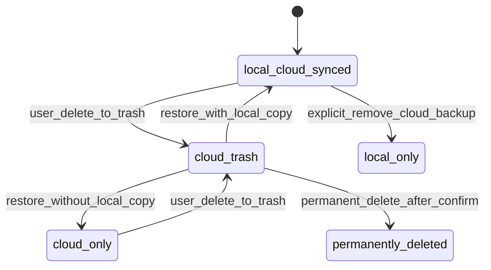

# Cloud Clip 정책 및 동기화 개선 계획 v1

## 0. 문서 목적

이 문서는 Cloud 백업/복원, Library 동기화, 구독 상태, 휴지통/복원, 튜토리얼 샘플 클립 정책을 하나의 실행 관리 단위로 정리한다.

이번 산출물은 정책 승인 후 Flutter/Dart 구현 반영까지 포함한다. Firebase rules/index, Functions, 플랫폼 설정, 결제 상품, Storage 경로, 컬렉션명은 변경하지 않는다.

## 1. 기준 문서 및 적용 원칙

| 구분 | 근거 문서 | 반영 원칙 |
|---|---|---|
| 최상위 운영 규칙 | `AGENTS.md` | 사용자 데이터 보존, 기존 기능 유지, 레거시 호환을 우선한다. 코드 변경 요청이 아닌 경우 Markdown 문서만 수정한다. |
| 현재 단계 | `CURRENT_PHASE.md` | 현재는 MVP 안정화와 MOA 브랜드 정렬 단계이며, Markdown 운영 문서 정리는 즉시 허용된다. 데이터/식별자/DB/패키지 변경은 보류한다. |
| 데이터 호환성 | `DATA_COMPATIBILITY.md` | Firestore 컬렉션명, Storage 경로, SharedPreferences key, IAP product id, 로컬 파일 구조는 별도 승인 없이 변경하지 않는다. |
| 기존 Cloud 릴리스 체크 | `plans/cloud_backup_restore_release_checklist_v1.md` | 복원, 중복 복원, 용량 부족, 구독 만료, 재설치 시나리오를 확장한다. |
| Local/Cloud 정책 | `plans/archive/three_sec_local_cloud_release_plan_v1.md` | local_only, local_cloud_pending, local_cloud_synced, cloud_only, locked 상태 모델을 기준으로 정책을 정렬한다. |
| Firestore 동기화 계약 | `plans/archive/firestore_usage_rules_and_sync_contract_v1.md` | `uid`, `videoId`, `storagePath`, `uploadStatus`, `storageUsage` 정합성을 유지한다. |
| 구독 강등 QA | `plans/archive/subscription_auto_downgrade_qa_checklist.md` | 만료 직전/당일/다음날 00:00 이후, 복원/재구매, 오프라인 경계조건을 검증 기준으로 유지한다. |
| 휴지통 복원 회귀 | `plans/archive/trash_restore_delete_regression_checklist.md` | 원래 앨범/폴더 복원과 fallback 복원을 Cloud 상태까지 확장한다. |
| 튜토리얼 정책 | `plans/archive/login_first_run_tutorial_plan.md`, `plans/archive/tutorial_sample_clip_to_video_plan_v1.md` | 기존 완료 사용자에게 샘플 클립을 재주입하지 않는 정책을 명시한다. |

## 2. 범위와 비범위

### 2.1 포함 범위

- Profile Cloud clip/사용량 실시간 연동 정책.
- 백업/복원 아이콘 의미 정책.
- Cloud 업로드 클립 삭제, Trash, 로컬 상태 전환, 복원 정책.
- 용량 부족 및 구독 만료 미검증 항목의 테스트 전략.
- 복사/이동 시 Cloud 상태 유지/복사 기본 정책.
- Standard 구독 상태의 촬영본 기본 Cloud 저장 정책.
- 앱 삭제 후 재설치/재로그인 시 Cloud Clip 개수와 Library 불일치 재동기화 정책.
- 기존 로그인 사용자 튜토리얼 샘플 클립 재주입 방지 정책.

### 2.2 제외 범위

- Flutter/Dart 코드 구현.
- Firestore rules/index, Storage rules, Functions, 플랫폼 설정 변경.
- Firestore 컬렉션명, Storage path, SharedPreferences key, IAP product id 변경.
- 로컬 인덱스 schema 확장 또는 migration 실행.
- 사용자 원본 영상, 프로젝트 JSON, 로컬 인덱스, 클라우드 백업 삭제/초기화.

## 3. 핵심 정책 결정 요약

| # | 이슈 | 권장 정책 | 우선순위 | 승인 필요 여부 |
|---|---|---|---|---|
| 1 | Profile Cloud clip/사용량 실시간 연동 | Cloud count와 storage usage는 서버 메타를 기준으로 표시하되 로컬 sync queue 상태를 별도 칩으로 분리한다. | P0 | 구현 시 데이터 읽기 계약 검토 필요 |
| 2 | 백업 아이콘 의미 | Cloud에 없는 항목을 Cloud로 올리는 액션은 업로드/백업 아이콘, Cloud에서 기기로 가져오는 액션은 다운로드 아이콘을 사용한다. cloud-slash류는 연결 끊김/사용 불가에만 사용한다. | P1 | UI 변경 승인 필요 |
| 3 | Cloud 클립 삭제/Trash/복원 | Cloud 클립 삭제는 기본적으로 Cloud tombstone/Trash 상태를 유지하며, 단순 local_only로 의미를 바꾸지 않는다. 복원 시 원래 storage tier와 cloud metadata를 복원한다. | P0 | 상태 필드/스키마 변경 시 별도 승인 필요 |
| 4 | 용량 부족 미검증 | 실제 저용량 기기 또는 에뮬레이터 저장소 제한으로 다운로드/복원/업로드 실패를 검증한다. 직접 재현 불가 시 mock quota와 실패 주입 로그로 대체한다. | P0 | 테스트 환경 승인 필요 |
| 5 | 구독 만료 후 미검증 | 만료 직전/당일/다음날 00:00 이후, 오프라인, 재구매/복원 경계를 분리 검증한다. Cloud 접근/삭제 정책은 실제 서버 운영 정책과 일치해야 한다. | P0 | 만료 후 Cloud 삭제/차단은 별도 승인 필요 |
| 6 | 복사/이동 시 Cloud 상태 | 이동은 동일 clip identity 유지, 복사는 기본적으로 로컬 복사본을 생성하고 Cloud 복사는 명시 선택으로 제한한다. | P0 | Cloud copy 구현 시 Storage/usage 계약 승인 필요 |
| 7 | Standard 촬영본 기본 Cloud 저장 | Standard 이상은 촬영 완료 후 로컬 저장을 먼저 확정하고, Wi-Fi 우선 자동 업로드를 기본 정책으로 한다. 실패해도 로컬 원본은 유지한다. | P0 | 자동 업로드 기본값 변경 시 사용자 고지 필요 |
| 8 | 재설치/재로그인 Library 불일치 | Profile Cloud Clip 수는 서버 집계, Library는 서버 `videos` pull 후 placeholder 또는 cloud_only 항목으로 재구성한다. | P0 | 로컬 인덱스 확장 시 별도 승인 필요 |
| 9 | 기존 사용자 튜토리얼 샘플 재주입 | `tutorial_completed_user_{uid}` 또는 서버 완료 이력에 해당하는 기존 로그인 사용자에게 샘플 클립을 자동 재주입하지 않는다. | P0 | key 변경 시 별도 승인 필요 |

## 4. 정책 상세

### 4.1 Profile Cloud clip/사용량 실시간 연동

#### 문제 정의

- Profile의 Cloud clip 개수와 사용량이 실제 Cloud 메타, 업로드 큐, 삭제/복원 상태와 다르게 보이면 사용자가 백업 안정성을 신뢰하기 어렵다.
- Cloud count가 보이지만 Library에는 항목이 보이지 않는 경우, 서버 메타와 로컬 인덱스 재구성의 책임이 분리되어야 한다.

#### 권장 정책

1. Profile에는 다음 값을 분리 표시한다.
   - Cloud Clip: 서버 `videos` 중 해당 `uid` 소유이며 Cloud에서 복원 가능한 clip 수.
   - Cloud Usage: 서버 `users/{uid}.storageUsage` 또는 멱등 usage accounting 결과.
   - Sync 상태: 로컬 큐 기준 `pending`, `uploading`, `failed`, `completed` 개수.
2. Cloud Clip/Usage는 로컬 파일 존재 여부와 독립적으로 서버 메타를 기준으로 계산한다.
3. 삭제/Trash/tombstone 항목은 기본 Cloud Clip count에서 제외하되, Trash count에는 별도 포함한다.
4. Profile 진입, 앱 foreground 복귀, 로그인 완료, 업로드/삭제/복원 완료 이벤트에서 refresh를 요청한다.

#### 검증 방법

- Standard 계정으로 업로드 성공 후 Profile Cloud Clip count와 Firestore `videos` count 비교.
- 업로드 실패/대기 중 항목은 Cloud Clip count에 포함하지 않고 Sync 상태 칩에 포함되는지 확인.
- Trash 이동 후 Cloud Clip count에서 빠지고 Trash count 또는 삭제 예정 상태로 표시되는지 확인.

### 4.2 백업/복원 아이콘 정책

#### 문제 정의

- Cloud-slash류 아이콘은 사용자가 Cloud 기능 비활성, 연결 끊김, 백업 해제, 삭제를 연상할 수 있다.
- Cloud에서 기기로 가져오는 복원 액션은 다운로드 의미가 더 명확하다.

#### 권장 정책

| 액션 | 권장 아이콘 의미 | 금지/주의 아이콘 의미 |
|---|---|---|
| 기기 항목을 Cloud로 백업 | upload, cloud-upload, backup | download, cloud-slash |
| Cloud 항목을 기기로 복원 | download, file-download | cloud-slash |
| Cloud 기능 사용 불가 | cloud-off, cloud-slash | download |
| 동기화 실패 | error, sync-problem | delete로 오해되는 아이콘 |
| 로컬 캐시 삭제 | device storage cleanup | cloud delete로 오해되는 아이콘 |

#### 검증 방법

- Cloud 보관함에서 복원 CTA가 다운로드 의미로 보이는지 스크린샷 QA.
- Library 카드의 백업/복원/사용 불가 상태가 서로 다른 아이콘과 라벨을 갖는지 확인.

### 4.3 Cloud 업로드 클립 삭제, Trash, 로컬 상태 전환, 복원 정책

#### 명확한 추천

Cloud 클립 삭제는 기본적으로 Cloud tombstone/Trash 상태를 유지하고, 삭제 액션의 의미가 단순 로컬화로 바뀌지 않도록 한다. 복원 시 원래 storage tier, cloud metadata, album/folder routing, favorite 등 사용자 메타를 가능한 한 복원한다.

#### 이유

- 사용자는 Cloud에 업로드된 클립을 삭제할 때 “Cloud 백업만 해제하고 로컬로 남김”보다 “휴지통으로 보냄/삭제 예정”을 기대할 가능성이 높다.
- 자동 local_only 전환은 삭제, 백업 해제, 다운로드, 소유권 변경의 의미를 혼동시킨다.
- 데이터 보존 원칙상 원본이 사라지지 않더라도 메타 의미가 바뀌는 것은 신뢰성 문제를 만든다.

#### 권장 상태 전이

#### 기본 정책

1. Cloud 업로드 완료 항목의 일반 삭제는 Trash/tombstone으로 이동한다.
2. Trash/tombstone 상태는 원래 Cloud metadata를 보존한다.
   - `videoId`, `uid`, `storagePath`, `fileName`, `fileSize`, 원래 album/folder, favorite, createdAt, completedAt 등.
3. 복원 시 원래 album/folder가 존재하면 원래 위치로 복원한다.
4. 원래 album/folder가 삭제되었으면 Library clip은 `일상`, Project는 `기본`으로 fallback한다.
5. “Cloud 백업만 제거하고 기기에는 남기기”는 삭제가 아니라 별도 고급 액션으로 분리한다.
6. 영구 삭제는 별도 확인과 멱등 usage 차감, Storage 객체 삭제, Firestore tombstone 처리 정책이 필요하다.

#### 예외 정책

| 예외 | 권장 동작 | 사용자 안내 |
|---|---|---|
| 로컬 원본만 남아 있고 Cloud metadata가 없거나 `storagePath`가 없음 | local_only로 유지하고 Cloud 복원 불가 상태 표시 | “이 항목은 기기에만 있어요. Cloud 복원 대상이 아닙니다.” |
| Cloud metadata는 있으나 Storage 객체 누락 | 복원 실패 상태로 표시하고 자동 삭제하지 않음 | “Cloud 파일을 찾을 수 없어요. 잠시 후 다시 시도하거나 지원팀에 문의하세요.” |
| 구독 만료 | 신규 업로드/Cloud 복원 권한은 서버 정책에 따른다. 로컬 원본은 유지한다. | “구독 상태 때문에 Cloud 작업을 진행할 수 없어요.” |
| 용량 초과 | Cloud upload/restore를 차단 또는 실패 처리하되 Trash metadata는 보존 | “Cloud 또는 기기 저장 공간이 부족해요.” |
| 오프라인 | 삭제/복원 의도는 pending tombstone/restore job으로 보존 | “네트워크 연결 시 반영됩니다.” |

#### 승인 필요 항목

- Tombstone 필드 추가, Trash 상태 필드 추가, 로컬 인덱스 schema 확장.
- Storage 객체 영구 삭제 자동화.
- Firestore rules/index 변경.
- 기존 문서 migration/backfill.

### 4.4 용량 부족 미검증 항목과 테스트 전략

#### 검증 대상

- Cloud 업로드 전 Cloud quota 초과.
- Cloud 복원 중 기기 저장 공간 부족.
- 다운로드 도중 부분 파일이 남는 경우.
- 캐시 정리 후 재시도 가능 여부.
- Profile 사용량 표시와 실제 차단 시점 정합성.

#### 1차 테스트 전략

1. 테스트 계정의 `storageUsage`를 제한 근처로 조정한 뒤 업로드 시도.
2. 대용량 샘플 또는 반복 업로드로 Standard quota 초과 경계 확인.
3. 에뮬레이터 저장 공간 제한 또는 실제 저용량 디바이스로 복원 실패 확인.
4. 복원 실패 후 Library에 부분 복원 항목이 정상 실패 상태로 표시되는지 확인.
5. 공간 확보 후 같은 Cloud 항목 재시도 시 중복 생성이 없는지 확인.

#### 대체 검증 전략

- 실제 저용량 환경 재현이 어렵다면 다운로드/쓰기 단계에 실패 주입 플래그를 두는 테스트 빌드로 검증한다.
- 서버 quota 조작이 어렵다면 테스트 계정의 quota mock 또는 Firestore emulator 기반 계약 테스트로 검증한다.
- 로그는 필요 시 `full`, `errors`, `appsignals`를 교차 확인하되, 이번 문서 작성 단계에서는 필수 열람 대상으로 보지 않는다.

### 4.5 구독 만료 후 미검증 항목과 테스트 전략

#### 정책 정렬 필요 지점

- 기존 릴리스 체크 문서에는 “만료 후 Cloud 백업 삭제/접근 불가” 정책이 정리되어 있으나, 실제 서버/Functions/운영 프로세스와 일치해야 한다.
- 기존 Local/Cloud 계획에는 다운그레이드 후 기존 cloud 데이터 보존 읽기전용 관점도 존재하므로, 최종 출시 전 제품 정책 결정을 명확히 해야 한다.

#### 권장 검증 매트릭스

| 시점 | 기대 동작 | 검증 방법 |
|---|---|---|
| 만료 직전 | Standard/Premium 권한 유지 | 앱 시작, 로그인 동기화, Profile refresh |
| 만료 당일 KST 00:00 전 | 강등되지 않음 | `shouldDowngrade=false` 로그 또는 상태 확인 |
| 만료 다음날 KST 00:00 이후 | Free 강등 및 신규 Cloud 작업 차단 | Profile tier, Cloud upload/restore 권한 확인 |
| 오프라인 만료 | 로컬 앱 동작 유지, 서버 정합화는 재연결 후 | 오프라인 앱 시작, 온라인 복귀 후 동기화 |
| 재구매/복원 | tier 상향과 Cloud 권한 복구 | IAP restore/purchase 후 Firestore tier 확인 |

#### 승인 필요 항목

- 만료 후 Cloud 데이터 자동 삭제, scheduler, Functions 검증.
- 만료 후 읽기전용 다운로드 허용/불허 최종 정책 변경.
- 결제 product id 또는 구독 검증 계약 변경.

### 4.6 복사/이동 시 Cloud 상태 유지 또는 Cloud 복사 기본 정책

#### 이동 정책

- 같은 사용자의 album/folder 이동은 같은 `videoId`/project identity를 유지한다.
- 이동은 Cloud 파일을 복제하지 않고 metadata의 album/folder routing만 변경한다.
- 이동 후 Profile Cloud Clip count와 usage는 변하지 않아야 한다.

#### 복사 정책

- 복사는 기본적으로 로컬 복사본을 생성하고 새 local identity를 부여한다.
- Cloud 복사는 사용자에게 명시 선택을 받는다.
- Cloud 복사를 선택한 경우 새 Cloud object와 새 metadata를 만들며 usage가 증가한다.
- Cloud 복사 실패 시 원본은 유지하고 복사본은 local_only 또는 failed_cloud_copy 상태로 둔다.

#### 이유

- 사용자가 “복사”를 눌렀을 때 Cloud 용량이 조용히 증가하면 예측 가능성이 낮다.
- “이동”은 위치 변경일 뿐 용량 증가가 없어야 한다.

#### 승인 필요 항목

- Cloud copy API 또는 Storage copy 구현.
- usage accounting 이벤트 추가.
- 로컬 인덱스에 clone source를 저장하는 schema 변경.

### 4.7 Standard 구독 상태에서 촬영본 기본 Cloud 저장 정책

#### 권장 정책

1. Standard 이상 사용자의 신규 촬영본은 먼저 로컬 저장 완료를 확정한다.
2. 로컬 저장 성공 후 자동 Cloud 업로드 job을 생성한다.
3. 기본 네트워크 정책은 Wi-Fi 우선이며, 모바일 데이터 업로드는 사용자 설정 또는 명시 동의에 따른다.
4. 업로드 실패, quota 초과, 오프라인이어도 로컬 원본은 삭제하지 않는다.
5. Profile과 Library는 pending/uploading/failed/completed 상태를 분리 표시한다.

#### 기본값 제안

| 항목 | 기본값 |
|---|---|
| Standard 신규 촬영본 | 로컬 저장 + Cloud 자동 업로드 대기 |
| Wi-Fi 연결 | 자동 업로드 진행 |
| 모바일 데이터 | 기본 보류, 설정으로 허용 가능 |
| quota 초과 | 로컬 저장 유지, Cloud 업로드 실패/보류 |
| 업로드 완료 후 로컬 원본 | 유지 기본, 자동 삭제하지 않음 |

### 4.8 앱 삭제 후 재설치/재로그인 시 Cloud Clip 개수는 보이나 Library에는 보이지 않는 문제

#### 문제 정의

- 재설치 후 로컬 인덱스와 파일 캐시는 비어 있을 수 있다.
- Profile은 서버 집계로 Cloud Clip 개수를 표시하지만, Library가 로컬 파일 스캔만 의존하면 Cloud 항목이 보이지 않을 수 있다.

#### 권장 재동기화 정책

1. 로그인 완료 후 `uid` 기준으로 서버 `videos` metadata를 pull한다.
2. 로컬 파일이 없는 항목은 `cloud_only` placeholder로 Library에 표시한다.
3. 썸네일이 없으면 서버 썸네일 또는 기본 Cloud placeholder를 표시한다.
4. 사용자가 항목을 열거나 복원 버튼을 누를 때 다운로드한다.
5. 재동기화 실패 시 Profile count와 Library 불일치를 경고/재시도 상태로 표시한다.
6. `storagePath`가 없는 레거시 문서는 복원 불가 가능성을 표시하고 자동 삭제하지 않는다.

#### 검증 방법

- Standard 계정으로 Cloud 업로드 완료.
- 앱 삭제 또는 앱 데이터 삭제.
- 재설치 후 동일 계정 로그인.
- Profile Cloud Clip count 표시 확인.
- Library에 cloud_only placeholder 또는 복원 가능한 Cloud 항목 표시 확인.
- 다운로드/복원 후 로컬 재생, 썸네일, 앨범 복원 확인.

### 4.9 기존 로그인 사용자에게 튜토리얼 클립을 다시 주입하지 않는 정책

#### 권장 정책

1. 기존 로그인 사용자 중 튜토리얼 완료 플래그가 있는 경우 샘플 클립을 자동 재주입하지 않는다.
2. 신규 계정 또는 튜토리얼 미완료 사용자에게만 샘플 클립 준비를 허용한다.
3. 앱 재설치 후에도 서버 또는 계정 기반 완료 이력이 확인되면 자동 재주입하지 않는다.
4. 사용자가 명시적으로 “튜토리얼 다시 보기”를 선택한 경우에도 기본값은 샘플 재주입 없음이며, 필요한 경우 확인 후 주입한다.
5. 이미 주입된 샘플은 idempotent marker로 중복 생성하지 않는다.

#### 데이터 보존 관점

- 기존 사용자의 Library에 의도치 않은 샘플 clip이 추가되면 개인 콘텐츠와 튜토리얼 콘텐츠가 섞인다.
- 튜토리얼 샘플은 자동 생성 데이터이므로 실제 사용자 촬영본과 명확히 구분되어야 한다.

## 5. 실행 체크리스트

| 상태 | 항목 | 담당 영역 | 우선순위 | 검증 방법 | 승인 필요 여부 |
|---|---|---|---|---|---|
| 구현중 | Profile Cloud Clip count와 storage usage 산정 기준을 서버 메타 기준으로 확정한다. | Product/Backend/Flutter | P0 | `CloudService.refreshCloudStatsSnapshot()`로 서버 count/usage/sync summary 갱신. `flutter analyze` 및 수동 Firestore 비교 필요 | 데이터 계약 변경 없음 |
| 구현중 | Profile sync 상태 칩을 Cloud count와 분리하는 UI 정책을 확정한다. | Product/Flutter | P1 | Profile에 pending/uploading/failed 요약 텍스트 추가. 스크린샷 QA 필요 | 승인 반영 |
| 구현중 | Cloud 복원 액션 아이콘을 다운로드 의미로 통일하고 cloud-slash 사용 범위를 제한한다. | Design/Flutter | P1 | Library mixed transfer 아이콘을 다운로드/오프라인 의미로 교체. cloud-off는 사용 불가 안내에만 유지 | 승인 반영 |
| 구현중 | Cloud 삭제는 Trash/tombstone 유지, local_only 자동 전환 금지 정책으로 확정한다. | Product/Backend/Flutter | P0 | Cloud delete/Trash 경로가 `lifecycleState=trash`, `cloudState=trash`, 원본 tier/path 보존하도록 보강. 물리 삭제 없음 | 승인 반영 |
| 구현중 | Cloud Trash 복원 시 원래 storage tier와 cloud metadata를 복원하는 시나리오를 정의한다. | Backend/Flutter/QA | P0 | restore 시 `originalStorageTier` fallback으로 `storageTier/cloudState` 복원. 원래 앨범/fallback 수동 QA 필요 | 승인 반영 |
| 구현중 | 로컬 원본만 남은 경우, 구독 만료, 용량 초과, 오프라인 예외 정책을 UI 문구와 매칭한다. | Product/Flutter/QA | P0 | upload 실패는 queue/failed UI 상태 유지. 용량/권한/오프라인 토스트는 기존 문구 재사용 | 문구 추가 승인 반영 |
| 수동검증필요 | 용량 부족 테스트 계정과 저용량 기기/에뮬레이터 전략을 준비한다. | QA/Backend | P0 | quota 초과, 디바이스 저장공간 부족, 부분 파일 잔존 확인 | 테스트 환경 승인 필요 |
| 수동검증필요 | 용량 부족 재현 불가 시 실패 주입 또는 emulator 기반 대체 검증 절차를 마련한다. | QA/Flutter | P0 | 이번 구현에서는 실패 주입 빌드 미도입. 수동 QA로 대체 | 테스트 빌드 승인 필요 |
| 수동검증필요 | 구독 만료 직전/당일/다음날 00:00 이후 시나리오를 Cloud 권한과 연결한다. | QA/Backend/IAP | P0 | `UserStatusManager.evaluateAndAutoDowngradeIfExpired()` 기반 정적 확인, sandbox 시간 경과 QA 필요 | 구독 검증 변경 없음 |
| 미시작 | 만료 후 Cloud 데이터 삭제/접근 불가 정책이 서버/Functions/운영 프로세스와 일치하는지 확인한다. | Product/Backend/Ops | P0 | Functions/scheduler/dry-run 결과 확인 | 반드시 필요 |
| 구현중 | Library 이동은 Cloud identity 유지, usage 변동 없음으로 확정한다. | Product/Flutter/Backend | P0 | 이동 시 cloud metadata 업데이트와 local index 이전 보강. Storage copy 없음 | metadata field merge만 수행 |
| 구현중 | Library 복사는 기본 local copy, Cloud copy는 명시 선택으로 확정한다. | Product/Flutter | P0 | 일반 복사는 `_cloudSyncedPaths`를 복제하지 않아 local copy 유지. Cloud copy는 후속 승인 항목 유지 | Cloud copy 미구현 |
| 구현중 | Standard 신규 촬영본은 로컬 저장 완료 후 Wi-Fi 우선 Cloud 자동 업로드 대기로 정의한다. | Product/Flutter/Backend | P0 | 로컬 저장/폴백 저장 후 `CloudService.uploadVideo()` queue 등록. 실패 시 local 유지/failed 상태 | 기본값 변경 고지 필요 |
| 구현중 | 재설치/재로그인 후 Library 서버 metadata pull과 cloud_only placeholder 정책을 정의한다. | Flutter/Backend | P0 | 로그인 후 `syncCloudMetadataToLibrary()` 호출, Library init/Profile refresh에서도 server metadata pull | 기존 로컬 인덱스 key 유지 |
| 미시작 | `storagePath` 없는 레거시 문서의 복원 불가/보류 안내를 정리한다. | Product/Backend/QA | P1 | 레거시 샘플 문서로 복원 시도 결과 확인 | backfill 시 필요 |
| 구현중 | 튜토리얼 완료 사용자에게 샘플 클립을 재주입하지 않는 gate를 정의한다. | Product/Flutter | P0 | 완료 플래그, legacy flag, local index, cloud metadata 존재 시 완료 처리 및 자동 주입 차단 | key 변경 없음 |
| 구현중 | 샘플 클립 중복 방지 marker와 수동 튜토리얼 다시 보기 정책을 분리한다. | Flutter/QA | P1 | `ensureTutorialSampleClips()` 자체에서도 gate 재확인. 수동 다시 보기는 후속 정책으로 유지 | marker schema 변경 없음 |

## 6. 테스트 불가 또는 즉시 재현 어려운 항목의 대체 검증 전략

| 항목 | 즉시 재현이 어려운 이유 | 대체 검증 전략 | 릴리스 전 최종 필요 조건 |
|---|---|---|---|
| 실제 Cloud quota 초과 | 실제 계정 데이터와 quota 조작 필요 | 테스트 계정 quota seed, emulator, 실패 주입 | 실제 Standard/Premium 경계 테스트 |
| 기기 저장 공간 부족 | 디바이스 상태 재현 난이도 높음 | 에뮬레이터 저장소 제한, 파일 쓰기 실패 mock | 실제 저용량 기기 1회 이상 확인 |
| 구독 만료 후 서버 삭제 | 결제 주기/Functions/운영 정책 결합 | sandbox 구독, 시계 조정, dry-run 로그 | 운영 정책 승인 및 rollback 계획 |
| 앱 삭제 후 재설치 | 실제 설치 상태/캐시 초기화 필요 | 앱 데이터 삭제로 1차 대체, 이후 실제 재설치 | 실제 재설치/재로그인 수동 QA |
| 레거시 `downloadUrl` only 문서 | 샘플 데이터 확보 필요 | synthetic legacy document 생성 | 실제 또는 익명화 샘플로 복원 결과 확인 |
| Cloud Storage 객체 누락 | 의도적 불일치 데이터 필요 | 테스트 bucket에서 metadata만 남긴 샘플 구성 | 자동 삭제 금지와 사용자 안내 확인 |

## 7. 릴리스 게이트

- Cloud 삭제가 local_only로 조용히 변환되는 경로가 남아 있으면 릴리스 보류.
- 복원 시 원래 album/folder 또는 fallback 위치가 불명확하면 릴리스 보류.
- Profile Cloud count와 Library cloud_only 표시가 재설치 후 영구 불일치하면 릴리스 보류.
- Standard 촬영본 자동 업로드 실패가 로컬 원본 삭제 또는 접근 불가를 유발하면 릴리스 보류.
- 기존 로그인 사용자에게 튜토리얼 샘플이 자동으로 재주입되면 릴리스 보류.
- 구독 만료 후 Cloud 접근/삭제 정책이 앱 문구, 서버 권한, 운영 프로세스 중 하나라도 불일치하면 릴리스 보류.
- Firestore/Storage path, IAP product id, SharedPreferences key, 로컬 인덱스 schema 변경이 별도 승인 없이 포함되면 릴리스 보류.

## 8. 승인 필요 항목 목록

| 항목 | 승인 필요 이유 |
|---|---|
| Firestore field 추가 또는 rename | 기존 client 호환, dual-read/write, backfill 필요 |
| Cloud tombstone/Trash schema 도입 | 삭제/복원 의미와 서버 권한에 영향 |
| Storage 영구 삭제 자동화 | 사용자 Cloud 백업 삭제와 usage 차감 영향 |
| 만료 후 Cloud 데이터 삭제/접근 차단 자동화 | 결제/운영/CS 리스크와 rollback 필요 |
| 로컬 인덱스 schema 확장 | 앱 재설치/로그인/Library 표시 계약 영향 |
| SharedPreferences key 변경 | 기존 사용자 튜토리얼/동기화 상태 호환성 영향 |
| IAP product id 또는 구독 검증 계약 변경 | 결제 복원/강등/권한 판정 영향 |
| Firestore/Storage rules/index 변경 | 보안과 쿼리 가능성 영향 |
| Cloud copy 기능 도입 | Storage usage 증가, 비용, quota accounting 영향 |

## 9. 다음 실행 순서 제안

1. 이 문서의 9개 정책 항목을 제품 정책으로 승인 또는 수정한다.
2. 승인된 정책을 기준으로 Flutter, Backend, QA 티켓을 분리한다.
3. schema/key/path 변경이 필요한 티켓은 별도 승인, dry-run, 백업, rollback plan을 먼저 작성한다.
4. 코드 구현 전 테스트 계정, quota, 구독 sandbox, 재설치 QA 절차를 준비한다.
5. 구현 후 `plans/cloud_backup_restore_release_checklist_v1.md`의 릴리스 체크리스트를 본 문서 기준으로 업데이트한다.

## 10. 구현 단계 검증 결과

- Flutter/Dart 코드 변경 있음.
- Firebase rules/index 변경 없음.
- Functions 변경 없음.
- 플랫폼 설정 변경 없음.
- 결제 상품 ID 변경 없음.
- Storage 경로/Firestore 컬렉션명 변경 없음.
- SharedPreferences key 변경 없음.
- 기존 로컬 인덱스 key는 유지하되, 이미 존재하던 cloud metadata optional field를 사용한다.
- 실제 사용자 데이터 삭제, Storage 대량 rename, migration/backfill 실행 없음.
- 정적 검증은 구현 후 `flutter analyze`로 수행한다.

### 10.1 수동 QA 체크리스트

1. Standard 계정으로 촬영 후 로컬 파일이 먼저 생성되고 Cloud upload queue 또는 completed 상태가 표시되는지 확인한다.
2. 업로드 완료 후 Profile Cloud Clip/Cloud 사용량과 Firestore `videos`/`users/{uid}.storageUsage`를 비교한다.
3. Cloud synced 클립을 휴지통으로 이동하면 `lifecycleState=trash`, `cloudState=trash`, `originalStoragePath`, `originalStorageTier`가 보존되는지 확인한다.
4. 휴지통에서 복원하면 원래 앨범 또는 fallback 앨범으로 돌아오고 Cloud 상태가 `active`로 복원되는지 확인한다.
5. 앱 데이터 삭제/재로그인 후 Library에 `cloud_only://` placeholder가 표시되고 복원 버튼으로 다운로드되는지 확인한다.
6. 기존 로그인 사용자, `isFirstRun=false` 사용자, 서버 Cloud metadata 보유 사용자에게 튜토리얼 샘플이 자동 주입되지 않는지 확인한다.
7. 용량 초과/권한/오프라인 실패 시 로컬 원본이 삭제되지 않고 pending/failed 상태가 남는지 확인한다.
