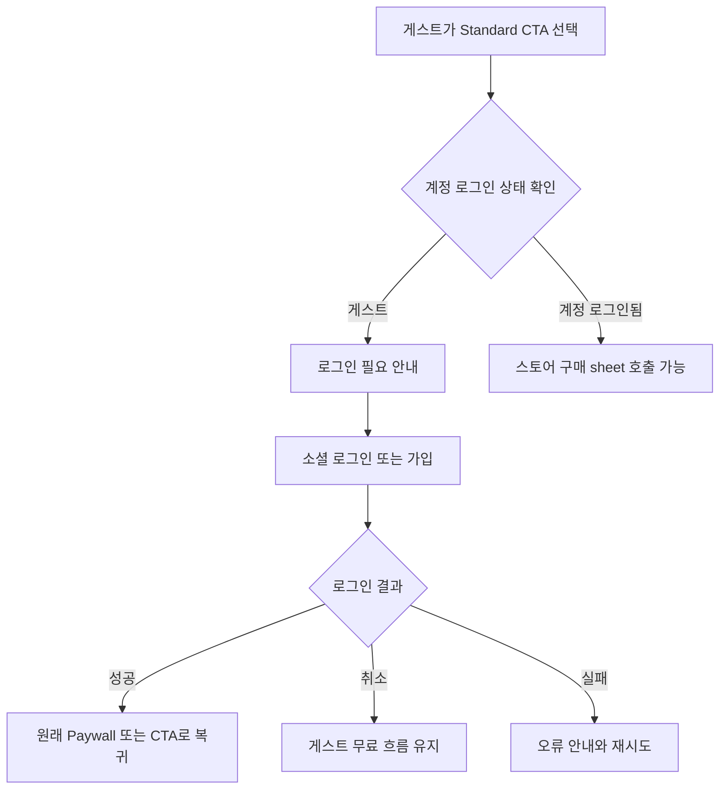
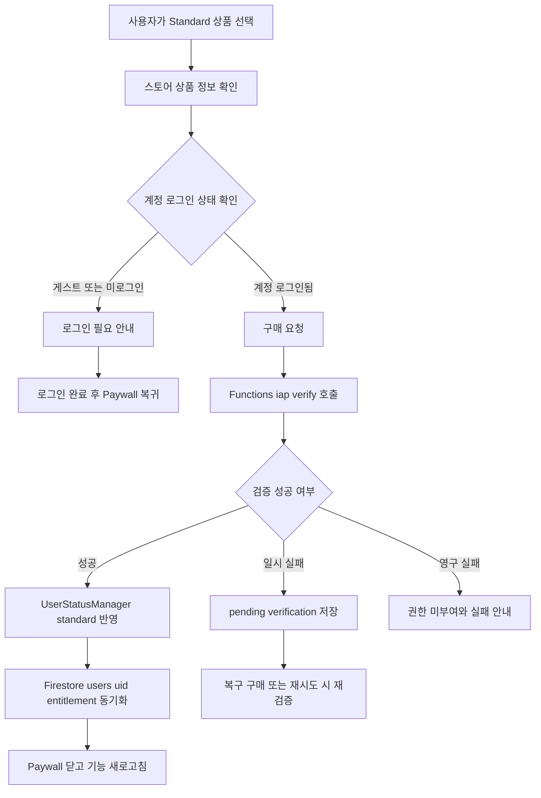

# Standard 유료 버전 단계 오픈 최적화 설계 v1

작성일: 2026-05-11  
문서 목적: 구현 없이 `Standard` 유료 버전만 먼저 오픈하기 위한 세밀 설계와 후속 구현 태스크 분해  
적용 범위: Flutter 앱, IAP 클라이언트, Firebase Functions 검증 계약, Firestore 사용자 entitlement 반영 계획  
구현 상태: 구현 금지, 계획 문서만 작성

---

## 1. 목적과 비범위

### 1.1 목적

- 기존에 숨김 처리해둔 유료 기능 중 `Standard` 버전만 단계적으로 오픈한다.
- `Premium` 상품과 `Premium` 전용 기능은 이번 릴리즈에서 계속 숨김 또는 비활성 상태로 유지한다.
- 기존 결제, 구독, 권한, 클라우드 저장 계약을 보존하면서 `Standard` 상품 판매와 권한 반영을 안정적으로 복구한다.
- 초기 로딩, 상품 조회, 권한 조회, 영수증 검증, Firestore 동기화를 최적화해 결제 UX의 실패 지점을 최소화한다.
- 후속 `Code` 또는 `Debug` 모드가 구현할 수 있도록 파일별 변경 예상 범위와 검증 명령을 계획 수준으로 분해한다.

### 1.2 비범위

- 이번 문서 작성 작업에서는 Dart, JavaScript, Gradle, Firebase rules, lock 파일을 수정하지 않는다.
- `Premium` 상품 노출, `Premium` 구매 CTA, `Premium` 업그레이드, `Premium` 전용 기능 오픈은 제외한다.
- `applicationId`, Firebase project id, Firestore 컬렉션/필드 계약, Storage 경로, SharedPreferences key, IAP product id 변경은 제외한다.
- 결제 서버 검증의 외부 Google Play Developer API 또는 App Store Server API 완전 연동은 별도 승인 대상이며, 이번 문서는 기존 계약 유지와 개선 방향만 설계한다.
- 대량 rename, 브랜드 전환 목적 식별자 변경, 사용자 데이터 마이그레이션은 제외한다.

---

## 2. 정책/호환성 근거

### 2.1 최상위 운영 원칙

- 사용자 원본 영상, 프로젝트 메타데이터, 로컬 인덱스, 계정 소유권, 구독/결제 상태, 클라우드 동기화 상태는 리팩터링보다 보존과 호환을 우선한다: [`AGENTS.md`](../AGENTS.md:17).
- 코드 변경 요청이 아닌 경우 Markdown 문서만 수정해야 한다: [`AGENTS.md`](../AGENTS.md:30).
- 결제 상태와 데이터 계약에 닿는 변경 전 기존 파일과 계획 문서를 읽고 근거를 확보해야 한다: [`AGENTS.md`](../AGENTS.md:34).
- IAP product id와 구독 검증 계약은 승인 필요 대상이다: [`AGENTS.md`](../AGENTS.md:45).
- `3s_standard_monthly`, `3s_standard_annual`, `3s_premium_monthly`, `3s_premium_annual` product id는 임의 변경 금지다: [`AGENTS.md`](../AGENTS.md:54).

### 2.2 현재 Phase 기준

- 현재 MVP 범위에는 `Free`, `Standard`, `Premium` tier와 자동 강등 정책 유지가 포함된다: [`CURRENT_PHASE.md`](../CURRENT_PHASE.md:14).
- `Standard` 이상 클라우드 이동/백업 흐름 안정화가 현재 범위에 포함된다: [`CURRENT_PHASE.md`](../CURRENT_PHASE.md:15).
- Functions endpoint, product id, provider uid 생성 규칙 변경은 승인 필요 작업이다: [`CURRENT_PHASE.md`](../CURRENT_PHASE.md:30).
- `3s_*` IAP product id 변경은 보류 작업이다: [`CURRENT_PHASE.md`](../CURRENT_PHASE.md:41).

### 2.3 데이터 호환성 원칙

- 변경 금지 IAP product ids는 `3s_standard_monthly`, `3s_standard_annual`, `3s_premium_monthly`, `3s_premium_annual`이다: [`DATA_COMPATIBILITY.md`](../DATA_COMPATIBILITY.md:19).
- `users/{uid}` 문서의 `subscriptionTier`, `storageUsage`, `lastUpdated` 등 사용자 상태 계약은 유지해야 한다: [`DATA_COMPATIBILITY.md`](../DATA_COMPATIBILITY.md:25).
- Firestore 컬렉션명과 필드 rename은 dual-read/write, backfill, old client 호환성 검증 없이는 금지한다: [`DATA_COMPATIBILITY.md`](../DATA_COMPATIBILITY.md:33).
- Storage 사용자 영상 경로 `users/{uid}/videos/{videoId}/{fileName}`는 유지한다: [`DATA_COMPATIBILITY.md`](../DATA_COMPATIBILITY.md:39).
- SharedPreferences key `3s_user_tier`, `3s_purchase_date`, `3s_product_id`, `3s_user_id`, `3s_next_user_tier`, `3s_next_tier_effective_at`, `3s_guest_login_enabled`는 변경 금지 또는 승인 필요 key다: [`DATA_COMPATIBILITY.md`](../DATA_COMPATIBILITY.md:72), [`DATA_COMPATIBILITY.md`](../DATA_COMPATIBILITY.md:78).

### 2.4 게스트 로그인과 소셜 로그인 근거

- 게스트 모드는 심사/무료 사용 fallback 목적이며 로컬 기본 기능만 허용하고 구독/클라우드 기능은 차단해야 한다: [`plans/archive/guest_login_review_fallback_plan.md`](archive/guest_login_review_fallback_plan.md:5), [`plans/archive/guest_login_review_fallback_plan.md`](archive/guest_login_review_fallback_plan.md:35).
- 게스트에서 정식 회원 전환 시 기존 로컬 데이터를 유지해야 한다: [`plans/archive/guest_login_review_fallback_plan.md`](archive/guest_login_review_fallback_plan.md:39), [`plans/archive/guest_login_review_fallback_plan.md`](archive/guest_login_review_fallback_plan.md:118).
- 소셜 로그인은 서버의 custom token 교환 API와 `SOCIAL_AUTH_EXCHANGE_URL` 설정에 의존하므로, 유료 구매 전 로그인 실패/취소 UX와 재시도 안내가 필요하다: [`plans/archive/social_login_integration_guide_kakao_naver.md`](archive/social_login_integration_guide_kakao_naver.md:10), [`plans/archive/social_login_integration_guide_kakao_naver.md`](archive/social_login_integration_guide_kakao_naver.md:214).
- `AuthService`는 `isSignedIn`과 `isGuest`를 별도 상태로 제공한다: [`isSignedIn`](../lib/services/auth_service.dart:430), [`isGuest`](../lib/services/auth_service.dart:433).
- 게스트 시작 시 로컬 tier를 Free로 리셋하고 guest user id를 설정한다: [`signInAsGuest`](../lib/services/auth_service.dart:1845), [`lib/services/auth_service.dart`](../lib/services/auth_service.dart:1850).
- 현재 Firestore 구독 동기화는 로그인된 Firebase 사용자 없이는 실패하도록 되어 있어, 유료 entitlement 부여는 계정 로그인 이후에만 안정적으로 완료된다: [`syncSubscriptionToFirestore`](../lib/services/auth_service.dart:1640), [`lib/services/auth_service.dart`](../lib/services/auth_service.dart:1645).

### 2.5 기술 작업 가이드

- Flutter 앱은 `in_app_purchase`, Firebase, `shared_preferences`, `provider` 등을 사용한다: [`SKILLS.md`](../SKILLS.md:8).
- Functions는 Node.js 20과 `firebase-functions`, `firebase-admin` 기반이다: [`SKILLS.md`](../SKILLS.md:9).
- `lib/managers/user_status_manager.dart`는 구독 관련 SharedPreferences key와 자동 강등 정책을 임의 변경하지 않아야 한다: [`SKILLS.md`](../SKILLS.md:104).
- `functions/index.js`는 social exchange와 IAP verify 계약을 다루므로 product id, provider uid, service account, CORS 정책 변경은 승인 필요다: [`SKILLS.md`](../SKILLS.md:105).
- 문서 변경 후 `AGENTS.md`, `DATA_COMPATIBILITY.md`, `RELEASE_RULES.md`와 충돌하지 않는지 확인해야 한다: [`SKILLS.md`](../SKILLS.md:117).

---

## 3. 기존 Free-only 출시 계획과의 관계

기존 Free-only 계획은 `PaywallScreen`, `SubscriptionManagementScreen`, IAP 초기화를 코드상 보존해 차후 과금 재개 시 빠르게 재활성화할 수 있도록 하는 방향이었다: [`plans/archive/ver1_free_initial_launch_plan_v1.md`](archive/ver1_free_initial_launch_plan_v1.md:119).

이번 계획은 그 보존된 결제 구조를 활용하되 다음 원칙을 적용한다.

| 구분 | Free-only 계획 | 이번 Standard 오픈 계획 |
|---|---|---|
| Paywall | 직접 접근 경로 제거 또는 비활성 | `Standard` 상품만 표시하고 구매 가능 |
| Subscription Management | 구독 메뉴 제거 또는 비노출 | Free/Standard 상태 확인, 복구 구매, 해지 이동 제공 |
| 게스트 로그인 | 무료/심사 fallback으로 허용 | 구매/복원/구독 관리 전 계정 로그인 필수 |
| Premium | 사용자 노출 제거 | 계속 숨김/비활성 유지 |
| Product ID | 유지 | 유지 |
| 권한 | Free 중심 | `Standard` 이상 기능 일부 오픈, `Premium` 기능 잠금 유지 |

---

## 4. 현황 분석

### 4.1 Paywall 화면

- `PaywallScreen`은 `IAPService`, `in_app_purchase`, `UserStatusManager`를 직접 사용한다: [`lib/screens/paywall_screen.dart`](../lib/screens/paywall_screen.dart:6), [`lib/screens/paywall_screen.dart`](../lib/screens/paywall_screen.dart:7), [`lib/screens/paywall_screen.dart`](../lib/screens/paywall_screen.dart:8).
- 현재 tier toggle은 `Standard`와 `Premium`을 모두 표시한다: [`_buildTierToggle`](../lib/screens/paywall_screen.dart:479), [`_buildToggleButton`](../lib/screens/paywall_screen.dart:489).
- 기본 선택 tier가 `Premium`이다: [`_selectedTierIndex`](../lib/screens/paywall_screen.dart:33).
- 현재 선택된 tier에 따라 `Premium` 또는 `Standard` product id가 선택된다: [`_currentMonthlyProductId`](../lib/screens/paywall_screen.dart:752), [`_currentAnnualProductId`](../lib/screens/paywall_screen.dart:758), [`_selectedProductId`](../lib/screens/paywall_screen.dart:764).
- 구매 완료 후 로컬 tier sync를 기다리고 화면을 닫는다: [`_handlePurchaseCompleted`](../lib/screens/paywall_screen.dart:131), [`_waitForLocalTierSync`](../lib/screens/paywall_screen.dart:142).
- 복구 구매 버튼은 `RESTORE` legal link를 통해 `IAPService.restorePurchases()`를 호출한다: [`_handleRestorePressed`](../lib/screens/paywall_screen.dart:165), [`_buildLegalTextButton`](../lib/screens/paywall_screen.dart:696).

### 4.2 구독 관리 화면

- `SubscriptionManagementScreen`은 `UserStatusManager`와 `IAPService`를 사용하며 앱 resume 시 상태를 갱신한다: [`lib/screens/subscription_management_screen.dart`](../lib/screens/subscription_management_screen.dart:22), [`_refreshSubscriptionState`](../lib/screens/subscription_management_screen.dart:47), [`didChangeAppLifecycleState`](../lib/screens/subscription_management_screen.dart:41).
- 구독하기 또는 플랜 변경 버튼은 `PaywallScreen`을 연 뒤 상태를 새로고침한다: [`_openPaywallAndRefresh`](../lib/screens/subscription_management_screen.dart:73), [`FilledButton.icon`](../lib/screens/subscription_management_screen.dart:138).
- 현재 기능 안내는 `Cloud 백업/이동: Standard 이상`, `편집 기능: Standard 이상`, `Free 720p · Standard 1080p · Premium 4K`를 표시한다: [`_FeatureGuideCard`](../lib/screens/subscription_management_screen.dart:296), [`_FeatureBullet`](../lib/screens/subscription_management_screen.dart:320).
- Android 구독 해지는 Google Play 정기결제 관리 화면으로 이동한다: [`_openCancelSubscription`](../lib/screens/subscription_management_screen.dart:214), [`launchUrl`](../lib/screens/subscription_management_screen.dart:236).

### 4.3 로컬 권한 저장과 자동 강등

- tier enum은 `free`, `standard`, `premium`을 이미 포함한다: [`UserTier`](../lib/managers/user_status_manager.dart:4).
- 로컬 저장 key는 `3s_user_tier`, `3s_purchase_date`, `3s_product_id`, `3s_user_id`, `3s_next_user_tier`, `3s_next_tier_effective_at`이다: [`lib/managers/user_status_manager.dart`](../lib/managers/user_status_manager.dart:20).
- `setTier()`는 tier, purchase date, product id를 SharedPreferences에 저장하고 예약 tier를 정리한다: [`setTier`](../lib/managers/user_status_manager.dart:161).
- `resetToFree()`는 구독 관련 로컬 key를 제거하고 `free`로 되돌린다: [`resetToFree`](../lib/managers/user_status_manager.dart:197).
- `isStandardOrAbove()`는 `standard` 또는 `premium`이면 true를 반환한다: [`isStandardOrAbove`](../lib/managers/user_status_manager.dart:221).
- `isPremium()`은 `premium`에서만 true를 반환한다: [`isPremium`](../lib/managers/user_status_manager.dart:226).
- 만료 기반 자동 Free 강등은 추정 만료 다음날 KST 00:00 이후 적용된다: [`evaluateAndAutoDowngradeIfExpired`](../lib/managers/user_status_manager.dart:240), [`autoDowngradeAt`](../lib/managers/user_status_manager.dart:92).

### 4.4 IAP 서비스

- product id 상수는 기존 네 개를 모두 보유한다: [`IAPService.standardMonthly`](../lib/services/iap_service.dart:85), [`IAPService.standardAnnual`](../lib/services/iap_service.dart:86), [`IAPService.premiumMonthly`](../lib/services/iap_service.dart:87), [`IAPService.premiumAnnual`](../lib/services/iap_service.dart:88).
- 현재 상품 조회 목록은 Standard와 Premium 네 개를 모두 포함한다: [`_productIds`](../lib/services/iap_service.dart:104).
- `initialize()`는 purchase stream 등록 후 상품 정보를 로드한다: [`initialize`](../lib/services/iap_service.dart:156), [`_loadProducts`](../lib/services/iap_service.dart:204).
- `purchase()`는 현재 tier와 target tier를 비교해 신규 구매, 업그레이드, 다운그레이드를 분기한다: [`purchase`](../lib/services/iap_service.dart:279), [`_resolvePlanChangeType`](../lib/services/iap_service.dart:1573).
- 구매 검증은 로컬 product id 검증, 서버 `/iap/verify` 호출, 검증 결과 캐싱과 pending retry를 포함한다: [`_verifyPurchase`](../lib/services/iap_service.dart:453), [`_verifyWithServer`](../lib/services/iap_service.dart:791), [`_retryPendingVerification`](../lib/services/iap_service.dart:1259).
- 검증 성공 시 product id에 따라 `standard` 또는 `premium` tier로 반영하고 Firestore에 동기화한다: [`_applyActiveSubscriptionToUserStatus`](../lib/services/iap_service.dart:1202), [`syncSubscriptionToFirestore`](../lib/services/iap_service.dart:1237).
- 구독 해지 상태는 Android에서 auto-renew off를 확인해 `nextTier=free` 예약으로 반영한다: [`syncCancellationStateFromStore`](../lib/services/iap_service.dart:1454).

### 4.5 Functions 검증 엔드포인트

- Functions는 `asia-northeast3`, 함수명 `social`, `/iap/verify` 경로를 사용한다: [`functions/index.js`](../functions/index.js:7), [`functions/index.js`](../functions/index.js:10).
- 허용 product id 목록에는 Standard와 Premium 네 개가 모두 포함되어 있다: [`ALLOWED_IAP_PRODUCT_IDS`](../functions/index.js:13).
- `/iap/verify`는 platform, productId, packageName, transaction id, purchaseToken, receipt, status 등을 파싱한다: [`handleIapVerify`](../functions/index.js:1442), [`functions/index.js`](../functions/index.js:1464).
- 지원 플랫폼은 `android`, `ios`로 제한된다: [`functions/index.js`](../functions/index.js:1497).
- product id가 허용 목록에 없으면 `INVALID_PRODUCT`로 거부한다: [`functions/index.js`](../functions/index.js:1511).
- 현재 검증 mode는 `schema_and_business_rule_only`이며 외부 스토어 서버 검증과는 구분된다: [`functions/index.js`](../functions/index.js:1602).

### 4.6 의존성

- 앱에는 `in_app_purchase`, Firebase, `url_launcher`, `intl`, `shared_preferences`, `http`, `provider`가 이미 포함되어 있다: [`pubspec.yaml`](../pubspec.yaml:33), [`pubspec.yaml`](../pubspec.yaml:36), [`pubspec.yaml`](../pubspec.yaml:53), [`pubspec.yaml`](../pubspec.yaml:54), [`pubspec.yaml`](../pubspec.yaml:56), [`pubspec.yaml`](../pubspec.yaml:63), [`pubspec.yaml`](../pubspec.yaml:64).
- Functions lint 스크립트는 `node --check index.js`다: [`functions/package.json`](../functions/package.json:11).

### 4.7 현재 게스트/계정 인증 흐름

- 메인 인증 게이트는 로그인 사용자 또는 게스트 모드면 메인 화면으로 진입시킨다: [`lib/main.dart`](../lib/main.dart:293).
- `AuthService`는 `AuthMode.guest`와 `AuthMode.signedIn`을 분리하고, `isSignedIn`과 `isGuest`를 별도 getter로 노출한다: [`AuthMode`](../lib/services/auth_service.dart:110), [`isSignedIn`](../lib/services/auth_service.dart:430), [`isGuest`](../lib/services/auth_service.dart:433).
- 로그인 화면에는 게스트 진입 버튼과 `signInAsGuest()` 호출 경로가 있다: [`lib/screens/login_screen.dart`](../lib/screens/login_screen.dart:135), [`lib/screens/login_screen.dart`](../lib/screens/login_screen.dart:319).
- 프로필 화면은 게스트 표시, 프로필 편집 차단, 로그아웃/계정 삭제 차단, 게스트에서 로그인하기 동선을 이미 일부 보유한다: [`_profileDisplayName`](../lib/screens/profile_screen.dart:113), [`_openEditProfileDialog`](../lib/screens/profile_screen.dart:189), [`_confirmSignOut`](../lib/screens/profile_screen.dart:412), [`_confirmSwitchFromGuestToSignIn`](../lib/screens/profile_screen.dart:608).
- Cloud 계층은 게스트 모드에서 uid 기반 조회와 cloud 작업을 차단한다: [`lib/services/cloud_service.dart`](../lib/services/cloud_service.dart:349), [`lib/services/cloud_service.dart`](../lib/services/cloud_service.dart:380).
- Paywall은 현재 `AuthService`를 참조하지 않고, 구매 CTA/복구 구매에서 게스트 여부를 먼저 검사하지 않는다: [`lib/screens/paywall_screen.dart`](../lib/screens/paywall_screen.dart:24), [`_handleRestorePressed`](../lib/screens/paywall_screen.dart:165), [`_selectedProductId`](../lib/screens/paywall_screen.dart:764).
- IAP 검증 성공 후 로컬 tier 반영과 Firestore 동기화가 이어지지만, Firestore 동기화 실패 반환값을 Paywall UX가 명시적으로 처리하지 않는다: [`_applyActiveSubscriptionToUserStatus`](../lib/services/iap_service.dart:1202), [`syncSubscriptionToFirestore`](../lib/services/auth_service.dart:1640), [`_handlePurchaseCompleted`](../lib/screens/paywall_screen.dart:131).

---

## 5. Standard 상품 정책

### 5.1 유지할 상품 ID

| 상품 | Product ID | 노출 정책 | 구매 정책 |
|---|---|---|---|
| Standard Monthly | `3s_standard_monthly` | 노출 | 구매 가능 |
| Standard Annual | `3s_standard_annual` | 노출 | 구매 가능 |
| Premium Monthly | `3s_premium_monthly` | 비노출 | 구매 차단 |
| Premium Annual | `3s_premium_annual` | 비노출 | 구매 차단 |

### 5.2 단계적 롤아웃 원칙

1. 클라이언트 UI에서는 `Standard` 월간/연간 상품만 보여준다.
2. `Premium` product id 상수와 서버 허용 목록은 호환성 때문에 삭제하지 않는다.
3. `Premium` 상품은 스토어 콘솔에서 활성 상태더라도 앱 UI에서 선택/구매할 수 없도록 한다.
4. 기존 `Premium` 사용자가 이미 존재할 수 있으므로 `UserTier.premium` 권한 판정과 구독 관리 표시는 호환 목적으로 보존한다.
5. 신규 사용자의 `Premium` 구매 진입은 숨기되, 복구 구매가 기존 `Premium` entitlement를 복구할 가능성은 정책적으로 결정이 필요하다. 권장안은 기존 구매자 보호를 위해 복구는 허용하되 신규 구매 CTA는 숨기는 것이다.

### 5.3 가격/카피 정책

- 가격은 스토어에서 내려온 `ProductDetails.price`만 표시한다.
- 문서나 코드에 하드코딩 가격을 넣지 않는다.
- CTA는 `Standard로 구독`, `Standard 시작하기`, `Standard 연간 구독`처럼 `Premium` 단어를 포함하지 않는다.
- `MOA PREMIUM` 배지와 금색 Premium 감성 카피는 `Standard` 오픈 단계에서 혼동을 만들 수 있으므로 `MOA STANDARD` 또는 `MOA PLUS` 계열로 정리하는 것을 권장한다.

---

## 6. 권한 모델 설계

### 6.1 tier 상태

| 상태 | 의미 | 저장 위치 | 주요 권한 |
|---|---|---|---|
| `free` | 무료 사용자 | SharedPreferences `3s_user_tier`, Firestore `users/{uid}.subscriptionTier` | 기본 촬영, 라이브러리, 720p export, 로컬 중심 기능 |
| `standard` | 이번 오픈 대상 유료 사용자 | 기존 product id와 purchaseDate 유지 | Cloud 백업/이동, 편집 기능, 1080p export, Standard 기능 |
| `premium` | 기존 호환/미래 준비 tier | 기존 product id와 purchaseDate 유지 | 기존 Premium 사용자 보호, 4K/고급 기능 권한 유지 가능하나 신규 노출은 금지 |

### 6.1.1 인증 상태와 entitlement 상태 분리

유료 오픈에서는 인증 상태와 상품 entitlement 상태를 절대 같은 값으로 취급하지 않는다.

| 축 | 예시 상태 | 의미 | 유료 흐름 정책 |
|---|---|---|---|
| 인증 상태 | `isGuest=true` | 로컬/심사 fallback 세션 | 무료 기능만 허용, 구매/복원/구독 관리 차단 |
| 인증 상태 | `isAuthenticatedAccount=true` 또는 `isSignedIn=true && isGuest=false` | Firebase uid가 있는 계정 세션 | 구매/복원/구독 관리/Firestore entitlement 부여 가능 |
| entitlement 상태 | `free` | 활성 유료 권한 없음 | Standard upsell 가능, 단 게스트면 먼저 로그인 필요 |
| entitlement 상태 | `standard` | Standard product 검증 완료 | Standard 기능 허용 |
| entitlement 상태 | `premium` | 기존 Premium 호환 권한 | 기존 사용자 보호, 신규 Premium 노출 금지 |

정책:

1. `isGuest`는 `free`와 동의어가 아니다. 게스트는 무료 사용 경로의 인증 모드이고, `free`는 entitlement tier다.
2. `isAuthenticatedAccount`는 `standard`와 동의어가 아니다. 로그인 계정도 결제 전에는 `free`일 수 있다.
3. 구매, 복원, 구독 관리, Firestore entitlement upsert는 `isAuthenticatedAccount=true`일 때만 시작한다.
4. 게스트 uid, 임시 uid, 로컬 `3s_user_id`에는 `standard` 또는 `premium` entitlement를 기록하지 않는다.
5. 게스트 세션에서 스토어 구매 sheet가 뜨면 안 된다. 차단은 `IAPService.purchase()` 호출 전, 가능하면 Paywall CTA handler 최상단에서 수행한다.

### 6.2 Standard에서 열 기능

- `isStandardOrAbove()` 기반으로 이미 분기 중인 기능을 우선 오픈한다.
- 후보 기능:
  - Cloud 백업/이동.
  - 편집 진입 및 편집 기능.
  - 1080p export.
  - Standard 저장 용량 정책.
- 현재 구독 관리 안내와 품질 정책은 `Standard`에서 1080p, `Premium`에서 4K로 설계되어 있다: [`_FeatureGuideCard`](../lib/screens/subscription_management_screen.dart:320), [`lib/utils/quality_policy.dart`](../lib/utils/quality_policy.dart:217).

### 6.3 Premium에서 계속 잠글 기능

- 4K export.
- 고급 편집 또는 AI 필터 등 `isPremium()` 또는 `advanced_editing`으로 묶인 기능.
- Premium 전용 CTA와 가격 카드.
- Premium 업그레이드 메시지.
- Premium 상품 구매 경로.

### 6.4 실패/검증 불가 fallback

| 상황 | 권장 fallback | 사용자 안내 |
|---|---|---|
| 상품 조회 실패 | 기존 entitlement 유지, 구매 CTA 비활성, 재시도 버튼 제공 | 가격 정보를 불러오지 못했습니다 |
| 구매 pending | 로딩 표시, 중복 구매 차단 | 구매 처리 중입니다 |
| 서버 검증 네트워크 실패 | 권한 즉시 부여 금지, pending verification 저장/재시도 | 결제 확인이 지연되고 있습니다 |
| 서버 검증 invalid | 권한 부여 금지, 기존 tier 유지 | 구매 확인에 실패했습니다 |
| Firestore 동기화 실패 | 로컬 entitlement는 검증 성공 시 보존, 재동기화 큐 또는 앱 재시작 시 재시도 설계 | 구독은 활성화되었지만 동기화가 지연됩니다 |
| 오프라인 | 구매 시작 제한 또는 스토어 실패 안내, 기존 권한은 캐시 사용 | 네트워크 연결 후 다시 시도해주세요 |
| 만료/취소 확인 | 만료일까지 유지, 이후 Free 자동 강등 | 만료일 이후 Free로 전환됩니다 |

### 6.5 게스트/계정 로그인 필수 정책

원칙:

1. 무료 사용은 게스트 로그인을 허용할 수 있다.
2. `Standard` 구매, 구매 복원, 구독 관리, 결제 검증 후 Firestore entitlement 부여는 반드시 계정 로그인이 된 상태에서만 허용한다.
3. 익명/게스트 uid 또는 로컬 guest id에 유료 entitlement를 기록하지 않는다.
4. 로그인 전 로컬 프로젝트, 영상, 로컬 인덱스, 게스트 데이터는 삭제하지 않는다.
5. 계정 전환 후 로컬 데이터 동기화, cloud ownership 연결, uid 재귀속, backfill은 별도 승인과 별도 설계 대상이다.

권장 guard 순서:

1. Paywall 진입 전 feature gate 또는 Profile/Subscription Management 진입점에서 `isGuest` 확인.
2. 게스트면 로그인 필요 sheet를 표시하고 `returnTo=paywall` 또는 `returnTo=standard_purchase_cta` 같은 리턴 의도를 메모리 route argument로 보존한다.
3. 사용자가 소셜 로그인 또는 계정 가입을 완료하면 원래 Paywall 또는 구매 CTA 위치로 복귀한다.
4. Paywall 내부 구매 CTA와 restore handler에서도 다시 `isAuthenticatedAccount`를 검사한다.
5. 검사를 통과한 후에만 `InAppPurchase.buy*` 또는 `restorePurchases()`가 호출되도록 한다.

게스트 구매 차단 copy 예시:

- 제목: `Standard 구독은 로그인이 필요합니다`
- 본문: `구독 권한을 계정에 안전하게 연결하기 위해 구매 전에 로그인해 주세요. 게스트로 만든 영상과 프로젝트는 삭제되지 않습니다.`
- 기본 버튼: `로그인하고 계속하기`
- 보조 버튼: `나중에 하기`

---

## 7. UI/UX 노출 설계

### 7.1 Paywall

권장 구조:

1. 화면 상단 배지: `MOA STANDARD`.
2. tier toggle 제거 또는 `Standard` 단일 카드로 대체.
3. 월간/연간 pricing card만 유지.
4. 기본 선택은 연간으로 유지 가능하나, 사용자가 월간을 쉽게 선택할 수 있게 동일 위계로 표시한다.
5. Premium benefit 문구, Premium CTA, Premium 색상 강조를 제거한다.
6. restore, terms, privacy link는 유지하되 terms/privacy 준비 상태가 릴리즈 전에 실제 링크 또는 명확한 안내로 정리되어야 한다.
7. catalog loading 중에는 CTA를 비활성화하고 shimmer 또는 텍스트 loading을 표시한다.
8. catalog error 시 retry를 제공하고 구매 버튼을 비활성화한다.
9. 게스트 상태에서 진입한 경우 가격/혜택은 볼 수 있어도 구매 CTA와 복구 구매는 로그인 필요 gate를 먼저 통과해야 한다.
10. `로그인하고 계속하기` 완료 후 원래 선택한 Standard 월간/연간 CTA로 복귀하되, 자동으로 스토어 sheet를 띄우지 말고 사용자가 다시 CTA를 누르게 하는 보수적 UX를 우선한다.

### 7.2 Profile 진입점

기존 Free-only 계획에서 구독 관리 메뉴와 결제 진입점을 숨겼다면, Standard 오픈 단계에서는 다음 정책으로 재노출한다.

- Free 사용자: `Standard 구독하기` 또는 `Cloud/편집 기능 열기` 메뉴 제공.
- Standard 사용자: 현재 플랜, 만료일, 복구 구매, 구독 해지 진입 제공.
- Premium 사용자: 기존 사용자 보호 표시만 제공하고 신규 Premium 유도 문구는 노출하지 않는다.
- 게스트 사용자: `Standard 구독하기` CTA를 누르면 구매 화면보다 계정 로그인/가입 안내를 먼저 제공한다. 로그인 완료 후 원래 Paywall 또는 Standard CTA로 복귀한다.

### 7.3 Subscription Management

- 현재 상태 카드와 만료일 카드는 유지한다.
- 버튼 라벨은 Free에서 `Standard 구독하기`, Standard에서 `Standard 플랜 관리`, Premium에서 `구독 상태 확인`처럼 Premium 구매 유도 없이 정리한다.
- 기능 안내는 이번 릴리즈에서 `Standard` 중심으로 정리한다.
- 해지 버튼은 구독 중일 때만 활성화한다.
- Android는 Google Play 정기결제 관리 화면으로 이동하고, iOS는 App Store 구독 관리 안내 또는 외부 URL 정책을 별도 확정한다.

### 7.4 Feature gate

- `Standard` 이상 필요한 기능을 눌렀을 때 바로 구매 화면을 띄우기보다 기능 가치와 현재 제한을 짧게 설명한 뒤 Paywall로 이동한다.
- `Premium` 전용 기능을 눌렀을 때는 이번 단계에서 `준비 중` 또는 `추후 제공 예정`으로 안내하고 Paywall을 열지 않는다.
- 4K 선택 UI는 `Premium` 전용 잠금 상태로 유지하되 `Premium` 구매 CTA는 숨긴다.

### 7.5 무료 사용자 안내

- 무료 사용자는 기존 핵심 사용 흐름을 유지한다.
- 제한 안내는 저장/편집/클라우드 등 실제 제한이 발생하는 지점에서만 노출한다.
- 결제 유도는 과도한 modal보다 inline banner 또는 feature gate sheet를 우선한다.

### 7.6 복구 구매

- Paywall과 Subscription Management 양쪽에서 접근 가능하게 유지한다.
- 게스트 상태에서는 복구 구매도 차단하고 계정 로그인을 먼저 요구한다.
- 복구 성공 후 즉시 로컬 tier와 Firestore 동기화 상태를 새로고침한다.
- 복구 결과가 지연될 수 있음을 안내한다.
- 기존 Premium 구매자의 복구는 사용자 데이터 보존 원칙상 허용하되, 신규 Premium 구매 CTA는 계속 숨긴다.
- 복구 구매는 스토어 계정과 앱 로그인 계정이 불일치할 수 있으므로 `복원된 구독이 현재 로그인 계정에 연결됩니다. 계정이 맞는지 확인해 주세요.` 수준의 사전 안내와 로그를 남긴다.

### 7.7 게스트에서 로그인 후 복귀 UX

권장 흐름:



세부 정책:

- 로그인 취소 시 게스트 세션과 로컬 데이터는 유지하고 Paywall 또는 이전 화면으로 돌아간다.
- 소셜 로그인 실패 시 실패 provider, 실패 code, `SOCIAL_AUTH_EXCHANGE_URL` 설정 여부, 네트워크 상태를 구분해 사용자 copy와 로그를 남긴다.
- 로그인 성공 후 `UserStatusManager.initialize()`와 auth bootstrap이 완료되기 전에는 구매 CTA를 잠시 disabled 처리한다.
- 게스트 세션 만료, 중복 탭, Paywall 다중 인스턴스는 동일한 auth gate 결과를 공유해야 하며, 중복 구매 요청은 차단한다.

---

## 8. 서버/클라이언트 검증 설계

### 8.1 클라이언트 구매 흐름



### 8.2 서버 검증 계약

- 기존 `/iap/verify` endpoint와 payload 구조를 유지한다.
- product id allowlist는 호환성 때문에 네 개를 유지할 수 있다.
- 클라이언트 UI 정책과 서버 allowlist 정책은 분리한다. 서버 allowlist에서 Premium을 제거하면 기존 Premium 복구가 깨질 수 있으므로 이번 단계에서는 제거하지 않는다.
- 서버 응답의 `valid`, `active`, `status`, `expiryTimeMillis`, `recoverable`, `productId`, `platform`, `transactionId` 계약을 유지한다.
- 현재 `verificationMode`가 `schema_and_business_rule_only`이므로 릴리즈 전 리스크로 명시한다. 실제 스토어 서버 검증 도입은 별도 승인과 보안 설계가 필요하다.

### 8.3 Firestore entitlement 반영

기존 Firestore 계약 기준:

- `users/{uid}.subscriptionTier`: `free|standard|premium`.
- `users/{uid}.productId`: 구매 product id 또는 null.
- `users/{uid}.purchaseDate`: 구매 timestamp 또는 null.
- `users/{uid}.storageLimit`: 서버 계산값 또는 클라이언트 동기화 정책.
- `users/{uid}.updatedAt`: 상태 변경 시각.

설계 원칙:

1. `Standard` 구매 검증 성공 시 `subscriptionTier=standard`, `productId=3s_standard_monthly|3s_standard_annual`로 upsert한다.
2. 실패 또는 검증 불가 시 Firestore entitlement를 올리지 않는다.
3. 해지 직후에는 즉시 Free로 강등하지 않고 만료 또는 예약 정보를 보존한다.
4. 기존 Premium 사용자 데이터는 강제 Standard로 낮추지 않는다.
5. Firestore 필드명 변경 없이 기존 `syncSubscriptionToFirestore()`, `syncPendingSubscriptionChangeToFirestore()`, `syncFreeTierToFirestore()` 계약을 활용한다.
6. `isGuest=true` 또는 `currentUser=null`이면 Firestore entitlement 반영을 시작하지 않는다.
7. 게스트 로컬 `3s_user_id` 또는 `guest_*` 형태 id를 `users/{uid}` 문서 id처럼 취급하지 않는다.
8. 결제 검증 성공 후 Firestore 반영 실패 시 사용자가 결제를 잃어버렸다고 느끼지 않도록 로컬 상태와 재동기화 필요 상태를 명확히 표시하되, 계정 uid가 불명확하면 유료 기능 선오픈을 보수적으로 제한한다.

### 8.4 Functions 영향도

- `ALLOWED_IAP_PRODUCT_IDS`는 유지한다.
- `FUNCTION_SERVICE_ACCOUNT`, region, function name, endpoint path는 변경하지 않는다.
- 결제 검증 로직 강화가 필요하면 별도 계획에서 Google/Apple API credential, secret storage, retry, audit logging, rollback을 설계한다.
- 이번 Standard 오픈 구현에서는 Functions 배포 없이 클라이언트 UI 노출만으로 가능한지 우선 검토한다.

---

## 9. 최적화 설계

### 9.1 초기 로딩

- 앱 시작 시 무조건 IAP 초기화가 사용자 체감 성능을 해치지 않는지 확인한다.
- 결제 진입 가능 화면 또는 Paywall 첫 진입 직전에 lazy initialize하는 옵션을 검토한다.
- 이미 startup warm-up이 있다면 중복 initialize 호출이 `_isInitialized`로 빠르게 반환되는지 확인한다.

### 9.2 상품 조회 최소화

- `IAPService` singleton의 `_products` 캐시를 활용한다.
- Paywall 진입마다 `queryProductDetails()`를 반복하지 않도록 TTL 또는 force refresh 정책을 설계한다.
- 이번 Standard 오픈에서는 UI에 필요한 `3s_standard_monthly`, `3s_standard_annual`만 표시하되, 내부 product list는 기존 네 개 유지 또는 조회 대상 축소 중 하나를 선택해야 한다.
- 권장안: 초기 구현은 조회 대상 네 개 유지, UI 필터링으로 Premium 비노출. 이후 스토어 notFound와 성능 문제가 있으면 조회 대상 축소를 별도 승인 검토한다.

### 9.3 권한 조회 캐싱

- `UserStatusManager` singleton의 메모리 상태를 우선 사용한다.
- 화면 build마다 `SharedPreferences`를 반복 로드하지 않도록 screen init, app resume, purchase return 시점에만 initialize를 호출한다.
- Firestore 서버값 우선 원칙이 필요한 화면에서는 네트워크 실패 시 로컬 캐시를 read-only fallback으로 사용한다.

### 9.4 중복 검증 방지

- 현재 `_verifiedPurchaseKeySet`, `_pendingVerificationKeySet`, `_pendingVerificationPayloadByKey` 구조를 유지한다.
- 검증 key는 product id와 order id 또는 purchase id 조합을 사용한다.
- 같은 purchase event가 반복 수신되어도 검증/entitlement 반영이 idempotent하게 동작해야 한다.
- pending verification은 앱 재시작 후에도 보존이 필요할 수 있으나, SharedPreferences 저장은 key 추가이므로 별도 승인 대상으로 분리한다.

### 9.5 오프라인/네트워크 실패 대응

- 구매 시작 전 네트워크 상태를 직접 검사하기보다 스토어/API 실패를 recoverable하게 처리한다.
- 서버 검증 timeout, socket error는 entitlement 미부여와 pending retry로 처리한다.
- 기존 entitlement 사용자는 네트워크 장애 중에도 로컬 tier를 유지한다.
- 신규 구매자는 검증 전까지 Standard 기능을 잠금 유지한다.
- 게스트가 오프라인에서 Standard CTA를 누르면 스토어 sheet를 띄우지 않고 로그인과 네트워크가 필요하다는 안내를 표시한다.

### 9.6 결제/인증 오류 대응 매트릭스

| 오류 상황 | 차단/복구 정책 | 사용자 안내 | 로그/관측 |
|---|---|---|---|
| 로그인 취소 | 구매 미시작, 게스트 무료 흐름 유지 | 로그인이 취소되었습니다. 게스트로 계속 이용할 수 있습니다. | `paid_auth_gate_cancelled`, return target |
| 소셜 로그인 실패 | 구매 미시작, 재시도와 다른 provider 선택 제공 | 로그인에 실패했습니다. 네트워크 또는 계정 설정을 확인해 주세요. | provider, error code, exchange URL configured 여부 |
| 로그인 네트워크 실패 | 구매 미시작, retry 제공 | 네트워크 연결 후 다시 로그인해 주세요. | provider, timeout, offline 추정 |
| 게스트 상태에서 결제 CTA | 스토어 sheet 호출 전 차단 | Standard 구독은 로그인이 필요합니다. | `guest_purchase_blocked`, product id 후보 |
| 게스트 상태에서 복구 구매 | restore 호출 전 차단 | 구매 복원은 로그인 후 이용할 수 있습니다. | `guest_restore_blocked` |
| 결제 검증 성공 후 DB 반영 실패 | 로컬 반영 여부를 보수적으로 표시, 재동기화 큐/앱 재시작 재시도 설계 | 구독 확인은 완료됐지만 계정 반영이 지연되고 있습니다. | uid, product id, transaction id masked, retry count |
| DB 반영 성공 후 클라이언트 캐시 갱신 실패 | Firestore 값 기준으로 refresh 재시도, 화면 내 재시도 제공 | 구독 상태 새로고침이 필요합니다. | `entitlement_cache_refresh_failed` |
| 게스트 세션 만료/중복 탭 | 최신 auth state 재확인, 중복 구매 요청 차단 | 로그인 상태를 확인한 뒤 다시 시도해 주세요. | route id, auth mode before/after |
| 복구 구매 계정 불일치 가능성 | 복구 전 계정 확인 copy, 복구 후 현재 uid에 연결 | 현재 로그인 계정에 구매 내역을 복원합니다. | current uid masked, store restore result |

### 9.7 UX 성능

- Paywall 비디오 배경은 네트워크 영상 URL 사용으로 초기 로딩과 실패 가능성이 있으므로 Standard 오픈 릴리즈에서는 정적 gradient fallback 또는 로컬 asset 검토가 필요하다.
- 가격 카드, benefit list, CTA는 catalog loading/error 상태에 따라 명확히 disabled 처리한다.
- Snackbar만으로 중요한 결제 상태를 전달하지 말고 화면 내 status text를 병행한다.

---

## 10. 단계별 실행 계획

### Phase 0. 조사와 릴리즈 기준선 확정

- 기존 결제 진입점 inventory를 최신 코드 기준으로 재점검한다.
- 스토어 콘솔에서 `3s_standard_monthly`, `3s_standard_annual` 상품 활성화 상태를 확인한다.
- `3s_premium_monthly`, `3s_premium_annual`은 앱 UI 비노출 정책을 확정한다.
- Functions `/iap/verify` URL 환경변수 `SOCIAL_AUTH_EXCHANGE_URL` 주입 상태를 확인한다.
- 샌드박스/테스트 계정, 환불/해지/복구 시나리오를 준비한다.
- 게스트 로그인 설정, 소셜 로그인 provider별 성공/취소/실패 시나리오, Paywall return target 정책을 확정한다.

### Phase 1. Standard 숨김 해제 최소 오픈

- Paywall에서 Premium toggle/card/CTA를 숨기고 Standard 월간/연간만 표시한다.
- Profile 또는 feature gate에서 Paywall 진입점을 Standard 중심으로 재노출한다.
- Subscription Management의 버튼과 기능 안내를 Standard 오픈 정책에 맞게 정리한다.
- `isStandardOrAbove()` 기반 기능을 Standard 구매 후 즉시 이용할 수 있게 새로고침 경로를 점검한다.
- Premium 신규 구매 경로가 남아 있지 않은지 검색과 수동 테스트로 확인한다.
- Paywall 구매 CTA, restore, Subscription Management 진입점에 계정 로그인 필수 gate를 추가한다.
- 로그인 완료 후 원래 Paywall 또는 Standard CTA로 복귀하는 return path를 구현한다.

### Phase 2. 안정화와 관측

- 상품 조회 실패, 구매 취소, pending, restore, 검증 지연 로그를 수집한다.
- Firestore entitlement와 로컬 SharedPreferences tier 불일치 사례를 점검한다.
- 구독 해지 후 만료일까지 권한 유지, 만료 후 Free fallback을 검증한다.
- 결제 실패 UX와 재시도 UX를 개선한다.
- Android와 iOS의 복구 구매, 해지 이동, 영수증 payload 차이를 점검한다.
- 게스트 차단, 로그인 취소, 소셜 로그인 실패, DB 반영 실패, 캐시 refresh 실패 로그를 수집한다.

### Phase 3. Premium 준비 분리

- Premium을 오픈하지 않고도 기존 Premium entitlement가 보존되는지 확인한다.
- Premium 신규 오픈은 별도 문서에서 상품 노출, upgrade/downgrade, 4K, 고급 기능, 가격 정책을 분리 설계한다.
- Premium 서버 검증 강화와 entitlement migration은 별도 승인, dry-run, rollback plan을 요구한다.

---

## 11. QA/릴리즈 체크리스트

### 11.1 Sandbox 구매

- [ ] Android sandbox에서 `3s_standard_monthly` 구매 성공.
- [ ] Android sandbox에서 `3s_standard_annual` 구매 성공.
- [ ] iOS sandbox에서 `3s_standard_monthly` 구매 성공.
- [ ] iOS sandbox에서 `3s_standard_annual` 구매 성공.
- [ ] 구매 후 `UserStatusManager.currentTier == standard` 확인.
- [ ] 구매 후 Firestore `users/{uid}.subscriptionTier == standard` 확인.
- [ ] 게스트에서 Standard CTA 클릭 시 스토어 구매 sheet가 뜨기 전 로그인 gate가 표시됨.
- [ ] 게스트 → 로그인 성공 → Paywall 복귀 → Standard 구매 성공.
- [ ] 게스트 → 로그인 성공 후 앱 재시작 → Paywall/Subscription 상태가 계정 기준으로 유지됨.

### 11.1.1 계정 로그인 필수/게스트 회귀

- [ ] 게스트 무료 사용 중 촬영/라이브러리/로컬 영상 생성은 유지됨.
- [ ] 게스트에서 구매 CTA 클릭 후 로그인 취소 시 로컬 프로젝트/영상/인덱스가 삭제되지 않음.
- [ ] 게스트에서 소셜 로그인 실패 시 게스트 세션이 유지되고 재시도 안내가 표시됨.
- [ ] 게스트 상태에서 restore purchases가 호출되지 않고 로그인 안내가 표시됨.
- [ ] 게스트 local `3s_user_id` 또는 `guest_*` 값으로 Firestore entitlement가 생성되지 않음.
- [ ] 로그인 완료 후 `isGuest=false`, `isSignedIn=true`, entitlement tier는 결제 전 `free`로 분리 표시됨.
- [ ] 중복 탭 또는 Paywall 다중 진입 상태에서도 구매 요청이 한 번만 발생함.

### 11.2 Premium 비노출

- [ ] Paywall에 `Premium` toggle 또는 가격 카드가 표시되지 않음.
- [ ] CTA에 `Premium으로 업그레이드`가 표시되지 않음.
- [ ] Premium product id가 신규 구매 버튼으로 전달되지 않음.
- [ ] 4K/Premium 전용 기능은 구매 유도 없이 잠금 또는 준비 중으로 표시.

### 11.3 복원/해지/만료

- [ ] Standard 구매 복원 성공.
- [ ] 기존 Premium 구매자의 복구 정책이 의도대로 동작.
- [ ] Android Google Play 구독 관리 이동 성공.
- [ ] 해지 후 만료일까지 Standard 권한 유지.
- [ ] 만료 또는 terminal inactive status 후 Free fallback.
- [ ] 다운그레이드 예약 UI가 혼란 없이 표시.
- [ ] 복구 구매 전 현재 앱 로그인 계정 확인 안내가 표시됨.
- [ ] 다른 스토어 계정/앱 계정 조합에서 복구 결과와 오류 copy가 혼란 없이 표시됨.

### 11.4 무료 fallback

- [ ] 상품 조회 실패 시 Free 기능은 정상 사용 가능.
- [ ] 서버 검증 실패 시 Standard 권한이 잘못 부여되지 않음.
- [ ] 네트워크 offline 상태에서 기존 Standard 사용자는 로컬 권한을 유지.
- [ ] 신규 구매 검증 불가 상태에서 기능이 선오픈되지 않음.
- [ ] 오프라인 게스트가 Standard CTA를 누르면 로그인/네트워크 필요 안내가 표시되고 구매가 시작되지 않음.
- [ ] 결제 검증 성공 후 Firestore 반영 실패 시 재시도/지연 안내가 표시되고 uid 없는 entitlement가 생성되지 않음.
- [ ] Firestore 반영 성공 후 클라이언트 캐시 갱신 실패 시 refresh 또는 앱 재시작 후 Standard 상태가 복구됨.

### 11.5 Android/iOS 차이

- [ ] Android purchaseToken, packageName 누락 시 적절히 실패.
- [ ] iOS receipt 누락 시 적절히 실패.
- [ ] Android autoRenewing false 처리와 `nextTier=free` 예약 확인.
- [ ] iOS 구독 해지 안내 UX 별도 확인.
- [ ] Android와 iOS 모두 게스트 구매 차단이 native store sheet 표시 전에 동작.
- [ ] iOS restore 구매와 Android restore 구매 모두 계정 로그인 필수 gate를 통과해야 동작.

### 11.6 회귀 테스트

- [ ] 촬영, 라이브러리, 외부 미디어 가져오기 기본 흐름 정상.
- [ ] Vlog 생성과 720p Free export 정상.
- [ ] Standard 구매 후 편집 진입 정상.
- [ ] Standard 구매 후 1080p export 가능.
- [ ] Premium 잠금 기능이 우회되지 않음.
- [ ] 로그아웃/재로그인 후 entitlement 복원 확인.

---

## 12. 승인 필요 항목

| 항목 | 필요 승인/확인 | 이유 |
|---|---|---|
| Google Play Console Standard 상품 활성화 | 승인 필요 | 실제 판매 상품 상태 변경 |
| App Store Connect Standard 상품 활성화 | 승인 필요 | 실제 판매 상품 상태 변경 |
| 결제 가격/무료 체험/프로모션 | 승인 필요 | 스토어 심사와 사용자 과금 정책 영향 |
| `SOCIAL_AUTH_EXCHANGE_URL` 주입/변경 | 승인 필요 | Functions endpoint 계약 영향 |
| Functions `/iap/verify` 계약 변경 | 승인 필요 | 서버 검증 계약과 배포 영향 |
| product id 변경 | 금지 | 데이터 호환성 위반 |
| Firestore 필드/컬렉션 변경 | 승인 필요 | 기존 사용자 entitlement 호환성 영향 |
| Storage 경로 변경 | 금지 또는 별도 승인 | 사용자 영상 데이터 보존 영향 |
| SharedPreferences key 변경 | 승인 필요 | 로컬 구독 상태와 자동 강등 영향 |
| 스토어 심사 제출 | 승인 필요 | 릴리즈 운영 범위 |

---

## 13. 구현 태스크 분해표

> 아래는 후속 구현 계획이며, 본 문서 작업에서는 실행하지 않는다.

| 파일 | 예상 변경 범위 | 검증 포인트 |
|---|---|---|
| [`lib/screens/paywall_screen.dart`](../lib/screens/paywall_screen.dart) | Premium toggle 제거 또는 숨김, 기본 선택 Standard, Standard 상품만 pricing card 연결, CTA/benefit 카피 Standard화, catalog error UX 강화, 구매 CTA와 restore handler 최상단에 계정 로그인 필수 gate 추가, 게스트 안내 copy와 로그인 return target 처리, 중복 구매 요청 차단 로그 추가 | Premium product id 구매 경로 미존재, Standard 월간/연간 구매 가능, restore 유지, 게스트에서 store sheet 미노출, 로그인 완료 후 Paywall 복귀, 로그인 취소/실패 copy, `guest_purchase_blocked` 로그 |
| [`lib/screens/subscription_management_screen.dart`](../lib/screens/subscription_management_screen.dart) | 버튼 라벨 Standard 중심 정리, 기능 안내 Premium 유도 제거, restore 진입 UX 명확화, iOS 안내 정리, 게스트 구독 관리 진입 시 로그인 gate 적용 | Free/Standard/Premium 기존 사용자 상태 표시, 해지 이동, app resume refresh, 게스트 restore 차단 |
| [`lib/screens/profile_screen.dart`](../lib/screens/profile_screen.dart) | 구독 관리 메뉴 또는 Standard upsell 진입점 재노출 여부 결정, 게스트에서 Standard CTA 클릭 시 로그인/가입 안내와 return path 연결 | Free 사용자만 적절히 유도, 기존 Premium 사용자 혼란 없음, 게스트 로컬 데이터 보존 copy 표시 |
| [`lib/screens/library_screen.dart`](../lib/screens/library_screen.dart) | Cloud/Standard 기능 gate에서 Paywall 진입점 재검토 | Free 제한 안내, Standard 구매 후 refresh |
| [`lib/screens/project_screen.dart`](../lib/screens/project_screen.dart) | 편집/프로젝트 진입 gate 문구 Standard 중심 정리 | Standard 구매 후 진입 가능, Free fallback 720p 유지 |
| [`lib/screens/video_edit_screen.dart`](../lib/screens/video_edit_screen.dart) | 1080p Standard enable, 4K Premium lock 유지, Premium 구매 CTA 숨김 | Standard 1080p 가능, Free 720p, Premium lock 우회 없음 |
| [`lib/managers/user_status_manager.dart`](../lib/managers/user_status_manager.dart) | 가능하면 변경 없음. 인증 상태와 entitlement 상태 분리 문서화만 검토 | 기존 SharedPreferences key 불변, 자동 강등 유지, `isGuest`와 `free` 혼동 없음 |
| [`lib/services/iap_service.dart`](../lib/services/iap_service.dart) | 가능하면 product id 상수 유지. UI 필터링 우선. 필요 시 public helper로 Standard product filtering 추가. 구매/복원 호출 전에 상위 UI gate가 동작하는지 방어 로그 검토 | product id 불변, pending verification 유지, restore 동작, 게스트에서 purchase/restore 미호출 |
| [`lib/services/auth_service.dart`](../lib/services/auth_service.dart) | 기존 Firestore sync 메서드 사용 확인. 필드 변경 금지. 필요 시 `isAuthenticatedAccount` helper와 return target 전달 방식 설계 | `users/{uid}` entitlement upsert 확인, 게스트 uid에 entitlement 미기록, 로그인 취소/실패 처리 |
| [`lib/screens/login_screen.dart`](../lib/screens/login_screen.dart) | 유료 gate에서 진입한 로그인 요청의 성공/취소/실패 결과를 호출자에게 돌려주는 경로 검토 | 로그인 성공 후 Paywall 복귀, 취소 시 게스트 유지, 소셜 실패 copy 표시 |
| [`lib/utils/error_copy.dart`](../lib/utils/error_copy.dart) | 로그인 필요, 로그인 취소, 소셜 실패, DB 반영 지연, 캐시 갱신 실패 copy 표준화 검토 | 결제/로그인 오류 copy 일관성, provider별 과도한 기술 노출 없음 |
| 로그/분석 이벤트 | `guest_purchase_blocked`, `guest_restore_blocked`, `paid_auth_gate_cancelled`, `paid_login_failed`, `entitlement_firestore_sync_failed`, `entitlement_cache_refresh_failed` 추가 검토 | 개인정보/토큰 미기록, uid/transaction id masking, QA 재현 가능 |
| [`functions/index.js`](../functions/index.js) | 기본안은 변경 없음. 향후 실제 스토어 서버 검증 강화 시 별도 설계 | `node --check index.js`, `/iap/verify` 계약 유지 |
| [`pubspec.yaml`](../pubspec.yaml) | 변경 없음 | dependency 추가 없이 동작 |

### 13.1 예상 검증 명령

```bash
flutter analyze
flutter test
```

Functions 변경이 있을 때만:

```bash
npm --prefix functions run lint
```

수동 QA:

```bash
flutter run --dart-define=SOCIAL_AUTH_EXCHANGE_URL=<configured-functions-url>
```

주의: 실제 명령 실행 전 환경변수, 테스트 계정, 스토어 sandbox 설정을 별도로 확인한다. 이 문서 작업에서는 명령을 실행하지 않았다.

---

## 14. 남은 리스크

- 현재 Functions 검증은 `schema_and_business_rule_only`로 표기되어 있어 실제 스토어 서버 검증과 동일하지 않다. 실결제 오픈 전 보안 리스크 평가가 필요하다.
- Paywall이 현재 네트워크 비디오 배경을 사용하므로 결제 화면 진입 성능과 실패 fallback을 확인해야 한다.
- 기존 Free-only 단계에서 결제 진입점이 여러 화면에서 숨겨졌을 수 있어 최신 코드 기준 전체 진입점 검색이 필요하다.
- Premium 신규 구매는 숨기되 기존 Premium 복구는 허용하는 정책이 UX와 서버 allowlist에서 명확해야 한다.
- Android와 iOS 구독 lifecycle, refund, grace period, billing retry 상태 처리 차이가 현재 로컬 추정 만료 정책만으로 충분한지 검증이 필요하다.
- Firestore 서버값 우선 원칙과 로컬 캐시 fallback 간 충돌 시나리오를 실제 QA에서 확인해야 한다.
- 현재 Paywall은 `AuthService` gate 없이 IAPService를 직접 사용하므로 구현 전까지 게스트 구매 차단이 설계에만 존재한다.
- 게스트에서 로그인 후 로컬 프로젝트/영상/인덱스를 계정 cloud 소유권과 연결하는 문제는 데이터 소유권 변경에 해당하므로 별도 승인과 설계가 필요하다.
- 결제 검증 성공 후 Firestore 반영 실패 또는 클라이언트 캐시 갱신 실패 시 사용자가 실제 결제 상태와 앱 권한 표시 불일치를 경험할 수 있어 관측과 복구 UX가 필요하다.
- 복구 구매는 스토어 계정과 앱 로그인 계정이 다를 수 있어, 어떤 계정에 entitlement를 연결할지 정책 copy와 로그가 부족하면 고객지원 이슈가 발생할 수 있다.

---

## 15. 결론

이번 Standard 오픈은 product id와 데이터 계약을 바꾸지 않고 UI 노출과 feature gate를 `Standard` 중심으로 복구하는 방식이 가장 안전하다. `Premium`은 product id, entitlement, 복구 호환성을 보존하되 신규 구매 노출을 막는다. 무료 사용은 게스트 모드를 허용할 수 있지만, Standard 구매/복원/구독 관리/Firestore entitlement 부여는 반드시 계정 로그인 이후에만 진행한다. 결제 성공 권한 부여는 기존 `IAPService` 검증 결과와 `UserStatusManager`/Firestore 동기화 경로를 재사용하고, 게스트 상태, 검증 실패, 네트워크 장애, DB 반영 실패 시 권한 선부여를 금지하는 보수적 fallback을 적용한다.
