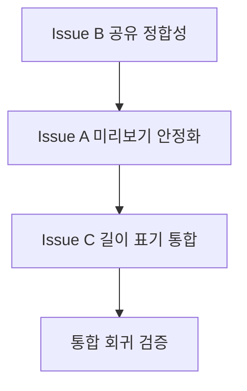

# bug_Trace_260427 계획 문서 v2

## 0) 범위 및 원칙
- 본 문서는 버그 수정 **계획 정교화**만 다룬다.
- 코드 수정, API 변경, 배포 작업은 본 문서 범위에서 제외한다.
- 이슈별 공통 템플릿: 증상, 재현 절차, 가설 원인, 수정 전략, 영향 범위, 검증 시나리오, 롤백 포인트.

---

## 1) 이슈 A - 라이브러리 클립 미리보기 미재생

### 1-1. 증상
- 라이브러리에서 클립 탭 후 미리보기 오버레이가 열리지만, 일부 단말/상황에서 자동 재생이 시작되지 않거나 정지된 상태로 남는다.

### 1-2. 재현 절차
1. 라이브러리 화면 진입
2. 클립 썸네일 탭
3. 미리보기 오버레이 노출 확인
4. 자동 재생 시작 여부 및 진행바 이동 여부 확인

### 1-3. 가설 원인
- `VideoPlayerController.initialize().then(...)` 비동기 완료 시점과 위젯 생명주기/상태 갱신 타이밍 레이스 가능성
- 파일 경로 유효성은 있으나 초기화 실패 시 사용자 피드백/재시도 경로 부족
- 오버레이 전환 시점에서 컨트롤러 준비 상태 점검 로깅 부족으로 원인 식별이 어려움

### 1-4. 수정 전략
- 미리보기 컨트롤러 초기화 성공/실패를 명시적으로 분기하고 실패 시 사용자 피드백/재시도 동작 정의
- 오버레이 진입 시 파일 존재 여부, 초기화 성공 여부, `isInitialized` 상태를 진단 로그 포인트로 표준화
- 자동 재생 실패 시 수동 재생 버튼 또는 재초기화 트리거를 복구 경로로 설계

### 1-5. 영향 범위
- UI: 라이브러리 오버레이 진입/종료 플로우
- 재생: 미리보기 컨트롤러 생명주기
- 사용자 체감: 클립 탐색 속도/신뢰성

### 1-6. 코드 위치 후보
- 화면 진입 및 오버레이 트리거: `lib/screens/library_screen.dart`
- 미리보기 재생 위젯: `lib/widgets/video_widgets.dart`

### 1-7. 검증 시나리오
- 정상 케이스: 클립 탭 직후 자동 재생 시작
- 반복 케이스: 연속 10회 이상 다른 클립 탭 시 재생 누락 없음
- 경계 케이스: 삭제/복원 직후 동일 클립 재진입 시 재생 정상
- 실패 케이스: 초기화 실패 시 사용자에게 오류 안내 + 복구 액션 제공

### 1-8. 롤백 포인트
- 재생 복구 로직 도입 후 크래시/ANR/재생 지연 증가 시 기존 단순 자동재생 플로우로 즉시 복귀

---

## 2) 이슈 B - 내보내기 후 공유 시 영상 누락 및 소개 문구 동봉 필요

### 2-1. 증상
- 결과 미리보기의 공유 액션 실행 시 영상 파일 첨부 없이 텍스트만 공유됨.

### 2-2. 재현 절차
1. 영상 내보내기 완료
2. 결과 미리보기에서 공유 버튼 탭
3. 공유 대상 앱에서 첨부 파일 존재 여부 확인
4. 텍스트 본문 동봉 여부 확인

### 2-3. 가설 원인
- 현재 공유 구현이 파일 첨부 API가 아닌 텍스트 공유 API 중심으로 구성
- 공유 직전 파일 존재/접근 가능성 검증 및 실패 폴백 규칙 부재

### 2-4. 수정 전략
- 목표 동작 고정: **영상 파일 우선 첨부 + 소개 문구 텍스트 동봉**
- 공유 실행 전 파일 존재/크기/접근 가능성 검증 단계를 계획에 명시
- 플랫폼별 공유 대상 앱 편차를 고려해 첨부 실패 시 진단 로그/사용자 안내 정책 수립

### 2-5. 영향 범위
- 결과 미리보기 공유 UX
- 외부 앱 연동 품질
- 마케팅 문구 일관성

### 2-6. 코드 위치 후보
- 공유 액션 진입점: `lib/main.dart`
- 결과 미리보기 버튼 영역: `lib/widgets/video_widgets.dart`

### 2-7. 검증 시나리오
- 정상 케이스: 공유 시 영상 파일이 첨부되고 소개 문구가 함께 전달
- 플랫폼 케이스: Android 주요 공유 대상 앱 3종 이상에서 첨부 확인
- 예외 케이스: 파일 경로 무효/권한 이슈 시 사용자 안내 및 로그 확인

### 2-8. 롤백 포인트
- 파일 첨부 방식 적용 후 공유 실패율이 상승하면 텍스트+경로 안내 방식으로 임시 복귀

---

## 3) 이슈 C - 클립 리스트 1s/2s 혼재 표기

### 3-1. 증상
- 클립 길이 배지에 `1s`, `2s`가 혼재되어 보이며 정책상 2초 클립 기대와 불일치.

### 3-2. 재현 절차
1. 클립 리스트/편집 목록 진입
2. 길이 배지 표기 관찰
3. 동일 세션/다른 세션에서 표기 일관성 비교

### 3-3. 가설 원인
- 초 단위 표기 시 단순 버림(`~/1000`)으로 인해 1.999s 근처 값이 `1s`로 표시
- 생성 경로별 실측 길이 편차(인코딩/트리밍)와 UI 포맷 정책이 분리됨

### 3-4. 수정 전략
- 표기 정책 명시: 2.0~2.1s 구간은 UI에 `2s`로 표준 표기
- 길이 계산 규칙을 단일 유틸 또는 공통 포맷터로 통합하는 방향 제시
- 캡처/추출/편집 각 경로의 길이 메타데이터 기준값을 문서로 정렬

### 3-5. 영향 범위
- 클립 리스트/편집 썸네일 길이 배지
- 사용자 인지 일관성
- QA 판정 기준

### 3-6. 코드 위치 후보
- 클립 정책 상수: `lib/constants/clip_policy.dart`
- 클립 추출 화면 길이 표기: `lib/screens/clip_extractor_screen.dart`
- 편집 화면 배지 표기: `lib/screens/video_edit_screen.dart`
- 공통 포맷 표시: `lib/widgets/media_widgets.dart`

### 3-7. 검증 시나리오
- 정상 케이스: 2.0~2.1s 클립이 모두 `2s`로 표기
- 경계 케이스: 1.95s, 1.99s, 2.00s, 2.05s, 2.10s 샘플 비교
- 회귀 케이스: 진행바/총 길이 표기의 분 단위 포맷 영향 없음

### 3-8. 롤백 포인트
- 표기 통합 후 기존 화면과의 불일치/민원 발생 시 화면별 기존 포맷으로 임시 복귀

---

## 4) 우선순위 및 작업 순서 (의존성 반영)

### 4-1. 우선순위
1. 이슈 B 공유 영상 누락 (대외 기능 실패)
2. 이슈 A 미리보기 미재생 (핵심 탐색 UX 저하)
3. 이슈 C 1s/2s 혼재 표기 (정책 일관성 이슈)

### 4-2. 실행 순서
1. 공유 경로 정합성 정리 및 실패 폴백 설계 (이슈 B)
2. 미리보기 초기화/재생 안정성 확보 (이슈 A)
3. 길이 표기 정책 통합 및 화면별 적용점 매핑 (이슈 C)
4. 통합 회귀 점검 (공유, 미리보기, 길이 배지)

### 4-3. 의존성 메모
- 이슈 C는 이슈 A/B와 직접 코드 의존은 낮지만, 최종 QA 단계에서 동일 빌드 기준으로 회귀 검증 필요
- 이슈 B의 공유 성공 기준 확정은 사용자 확인 완료: 영상 파일 우선 첨부 + 소개 문구 텍스트 동봉

---

## 5) 완료 정의 (Definition of Done)

### 5-1. 기능 DoD
- 이슈 A: 라이브러리 미리보기 진입 시 자동 재생 성공률이 QA 시나리오 기준 충족
- 이슈 B: 공유 결과에 영상 파일 첨부 + 소개 문구 동봉이 재현 가능
- 이슈 C: 정의된 길이 구간에서 `2s` 표기가 일관되게 유지

### 5-2. 품질 DoD
- 각 이슈별 실패 로그 포인트와 사용자 안내 문구가 명세됨
- 정상/경계/실패 시나리오 테스트 케이스가 문서화됨
- 회귀 체크리스트에 공유/미리보기/길이표기가 모두 포함됨

### 5-3. 배포 판단 DoD
- 핵심 3이슈 재현 불가 확인
- 기존 주요 플로우(내보내기, 편집, 라이브러리 탐색) 회귀 없음
- 롤백 조건/복귀 경로가 운영 문서에 반영됨
