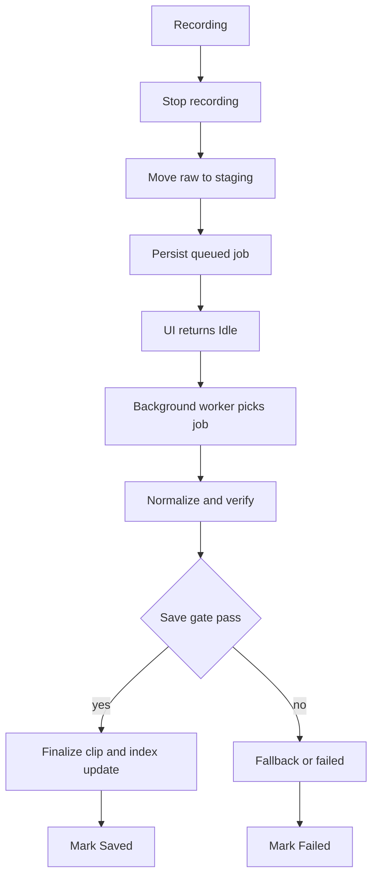

# 촬영 즉시 재진입 + 백그라운드 정규화 분리 설계안 v1

## 1. 목표
- 촬영 종료 직후 다음 촬영 버튼을 즉시 복귀
- 정규화 및 저장 후처리는 백그라운드 워커로 분리
- 앱 재시작 시에도 미완료 작업 복구
- 기존 길이 정책 유지
  - 저장 목표: [`kTargetClipMs`](lib/constants/clip_policy.dart:1)
  - 캡처 목표: [`kTargetCaptureMs`](lib/constants/clip_policy.dart:4)
  - 저장 게이트: [`kClipSaveMinExclusiveMs`](lib/constants/clip_policy.dart:18)

## 2. 현재 블로킹 경로
- 현재 [`_stopRecording()`](lib/screens/capture_screen.dart:718)에서 [`videoManager.saveRecordedVideo(video)`](lib/screens/capture_screen.dart:742)를 `await`
- [`saveRecordedVideo()`](lib/managers/video_manager.dart:2958)가 정규화/검증/폴백/인덱스 갱신까지 동기 대기
- 결과적으로 촬영 버튼 복귀가 정규화 완료 시점까지 지연

## 3. 채택안
- **B안 채택**: SharedPreferences 기반 영속 큐 + 단일 워커 직렬 처리

## 4. 상태 모델
- `Idle`
- `Recording`
- `Stopping`
- `Queued`
- `Processing`
- `Saved`
- `Failed`

## 5. 데이터 모델
- 신규 `RecordedClipSaveJob` (촬영 전용)
  - jobId
  - sourceStagingPath
  - albumName
  - createdAtMs
  - status
  - retryCount
  - lastErrorCode
  - lastErrorMessage

## 6. 처리 흐름

## 7. 경쟁 조건 및 대응
- 중복 enqueue
  - `jobId` 기준 upsert, 동일 원본 중복 삽입 차단
- 동시 정규화
  - 단일 워커 락으로 직렬화
- 앱 강제 종료
  - `Processing` 상태는 앱 재시작 시 `Queued`로 복구
- 파일 유실
  - 시작 시 `sourceStagingPath` 존재 검증, 없으면 `Failed(input_missing)`
- 사용자 삭제/이동 충돌
  - `Queued` 또는 `Processing` 대상은 보호 정책 적용

## 8. UX 정책
- 버튼 재활성화 시점
  - 스테이징 + 큐 영속화 성공 직후
- 목록 노출 시점
  - 정규화 완료 후 `Saved`에서만 노출
- 실패 표시
  - 배너/토스트 + 재시도 액션

## 9. 구현 단계
1) MVP
- [`_stopRecording()`](lib/screens/capture_screen.dart:718)에서 동기 저장 대기를 제거
- enqueue API 신설 후 즉시 UI `Idle`
- 단일 워커 실행 및 처리 로그 추가

2) 영속 복구
- 앱 시작 시 큐 hydrate
- stale `Processing` 복구
- 실패 코드 분류 체계 반영

3) 안정화
- 삭제/이동 보호 정책
- 스테이징 정리 정책
- 계측 지표 수집

## 10. 롤백 전략
- feature flag로 비동기 큐 비활성화
- 즉시 기존 동기 경로([`saveRecordedVideo()`](lib/managers/video_manager.dart:2958) await)로 복귀

## 11. 수용 기준
- 촬영 종료 후 버튼 복귀 지연이 정규화 시간과 분리
- 연속 촬영 중에도 워커가 안정적으로 저장 처리
- 앱 재시작 후 미완료 작업 재개
- 저장 길이 정책 유지 및 게이트 위반 클립 비노출
