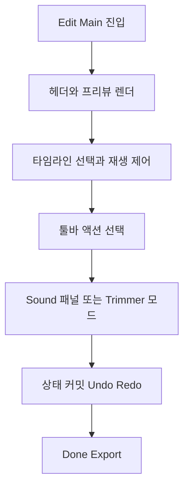

# Edit Main + Sound + Trimmer 통합 개선안

## 1) 범위와 고정 조건
- 적용 범위: Edit Main, Sound 패널, Trimmer UI 통합 개선
- 고정 조건: 좌상단 AI 버튼은 미적용, 좌상단은 X 버튼 유지
- 기능/문구는 기존 유지, 시각 디자인과 레이아웃 구조 중심으로 개선

## 2) 현재 구현 기준점
- 메인 편집 화면 진입점: `lib/screens/video_edit_screen.dart`
- 헤더: `_buildHeader`
- 프리뷰: `_buildPreviewSection`
- 타임라인: `_buildTimelineSection`, `_buildExpandedTimelineItem`
- 하단 툴바: `_buildGlassToolbar`, `_buildToolbarItem`
- 사운드 시트: `_showSoundMenu`

## 3) 벤치마크 핵심 패턴 요약

### A. Edit Main
1. 상단은 밝은 배경 고정, 중앙 제목 + 우측 Done 강한 CTA
2. 프리뷰는 9:16 카드형, 라운드 큰 값, 하단 오버레이 진행바/시간
3. 타임라인은 선택 썸네일 강조링 + 중앙 플레이헤드 인디케이터
4. 하단 툴은 아이콘 카드형 + 라벨, 선택 상태가 명확

### B. Sound
1. 메인 프레임은 유지하고, 하단 패널이 둥근 상단 모서리로 올라오는 구조
2. 패널 헤더는 Audio Mixer 타이틀 + Reset/Apply 액션
3. 각 오디오 행은 아이콘/라벨/슬라이더/값 구조
4. 전체 톤은 밝은 배경 + 저채도 블루 포인트

### C. Trimmer
1. 편집 집중 모드에서 하단 글로벌 내비 숨김
2. 좌우 트림 핸들, 비선택 구간 딤 처리, 선택 구간 강조색
3. 상단/하단 컨트롤은 편집 집중용으로 간결화

## 4) 갭 분석

### A. 헤더
- 현재: 그라데이션 오버레이 기반 어두운 헤더 + Export 라벨
- 목표: 밝은 상단 바, X/Undo/Redo/Done 구조로 일관화
- 조정: Done 라벨로 통일, 버튼 라운드/높이 키워 강조

### B. 프리뷰
- 현재: 상하 포지셔닝 하드코딩, `aspectRatio`가 원본 비율에 종속
- 목표: 고정 9:16 카드 우선, 하단 진행 정보의 가독성 확보
- 조정: 프리뷰 컨테이너를 중앙 카드형으로 고정, 오버레이 간격 재정렬

### C. 타임라인
- 현재: 일반 모드/트림 모드가 시각 언어가 다소 분리됨
- 목표: 선택 상태 링, 중앙 플레이헤드, 썸네일/시간 배지 통일
- 조정: 공통 썸네일 스타일 토큰화, 선택/비선택 대비 일관화

### D. 툴바
- 현재: 텍스트 중심의 단순 아이콘+라벨
- 목표: 카드형 아이콘 버튼 + 라벨 + 활성 상태 강조
- 조정: 각 툴 버튼을 동일 크기 카드로 구성, Effects 스타일 포인트 적용

### E. Sound 패널
- 현재: 다크 바텀시트 + 기본 슬라이더
- 목표: 밝은 카드형 패널, Audio Mixer 헤더, Reset/Apply 액션
- 조정: 바텀시트 테마 전환, 행 구조 정렬, 퍼센트 표시 고정폭 처리

### F. Trimmer
- 현재: 디버그 잔재 코드 및 단색 플레이스홀더, 스크러버 비활성 주석
- 목표: 실제 썸네일 기반 트림 바 + 핸들 + 포커스 모드
- 조정: 트림 UI 정상화, 스크러버 복구, 선택 구간/비선택 구간 대비 강화

## 5) 구현 전략

### 1단계: 공통 디자인 토큰 정리
- 색상: 배경/텍스트/포인트 블루/보조 퍼플/트림 옐로우
- 간격: 4/8/12/16/20/24 스케일
- 라운드: 12, 16, 20, 24
- 그림자: 카드/선택/패널 3종

### 2단계: 레이아웃 구조 재편
- `Scaffold` 본문을 상단 바, 프리뷰 영역, 타임라인, 하단 툴바로 명확 분리
- 하드코딩 `Positioned` 수치를 축소하고, 섹션별 고정 높이/유연 레이아웃 혼합

### 3단계: Edit Main UI 리빌드
- 헤더를 밝은 테마로 전환
- 프리뷰 9:16 카드 강제 및 오버레이 위치 재배치
- 타임라인 선택 링/중앙 플레이헤드 정렬
- 하단 툴 버튼 카드화

### 4단계: Sound 패널 리디자인
- `_showSoundMenu`를 밝은 패널로 재구성
- 헤더에 Audio Mixer + Reset/Apply 배치
- Original/BGM 행을 동일 컴포넌트로 추출
- 슬라이더 트랙/썸/값 스타일 통일

### 5단계: Trimmer 집중모드 정비
- 트림 모드 진입 시 하단 글로벌 내비 숨김 유지
- 디버그 코드 제거, 스크러버/핸들 인터랙션 복구
- 트림 핸들 히트영역 확대 및 최소 구간 보장

### 6단계: 상호작용/접근성
- 터치 타깃 최소 44dp
- 밝은 배경 대비 텍스트 명도 보정
- 상태 변화 애니메이션은 120~220ms 내로 제한

## 6) 코드 모드 전달용 체크리스트
- [ ] 헤더를 X-중앙제목-Done 구조로 통일하고 AI 버튼 제거 유지
- [ ] 프리뷰를 9:16 카드형으로 고정하고 오버레이 진행바/시간 정렬
- [ ] 타임라인 선택/비선택 스타일을 통합하고 중앙 플레이헤드 반영
- [ ] 하단 툴바를 카드형 아이콘 버튼 구조로 리팩터링
- [ ] Sound 바텀시트를 Audio Mixer 패널 디자인으로 재구성
- [ ] Trimmer UI 디버그 코드 제거 및 스크러버 복구
- [ ] 색상/간격/라운드 상수화로 중복 스타일 정리
- [ ] 실제 기기 기준 스크롤/터치/가독성 회귀 점검

## 7) 리스크와 방지책
- 리스크: `Stack + Positioned` 의존 구조로 레이아웃 충돌 가능
  - 방지: 섹션 단위 레이아웃 위주로 재배치 후 오버레이 최소화
- 리스크: 트림 상태와 재생 상태 동기화 깨짐
  - 방지: 트림 핸들 변경 시 seek/loop 경계 일관화
- 리스크: 사운드 시트 상태와 Undo/Redo 경합
  - 방지: 슬라이더 `onChangeEnd` 커밋 규칙 유지, 미리보기는 임시 상태만 갱신

## 8) 간단 흐름도

