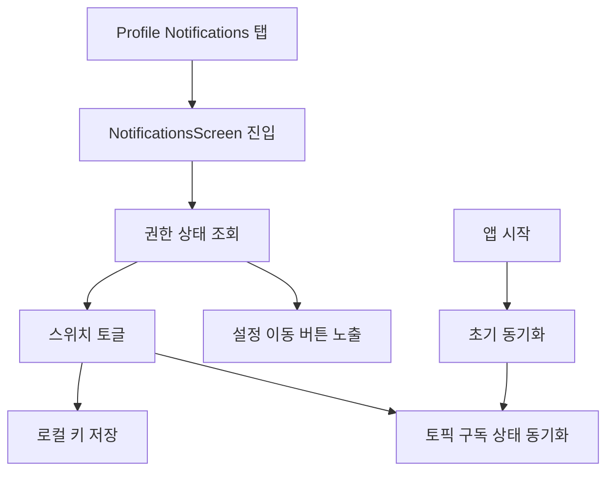

# Notifications MVP 계획 v1

## 1. 목표
- Notifications 공백 상태를 해소하고, 최소 기능으로 사용자 제어를 제공
- 범위는 아래 3가지로 고정
  - 권한 상태 확인
  - 앱 내 수신 on off 스위치
  - 시스템 설정 이동 버튼

## 2. 현재 코드 기준 진단 요약
- 프로필 메뉴의 Notifications 항목은 탭 핸들러가 없어 진입 불가
- 초기 권한 팝업 로직은 메인에만 존재
- 수신 on off를 저장하는 별도 로컬 키 및 토픽 동기화 레이어가 없음
- 클라우드 사용량 90퍼센트 알림은 TODO 상태

## 3. MVP 설계

### 3.1 화면 구조
- 새 화면: `NotificationsScreen`
- 진입: `ProfileScreen` 의 Notifications 메뉴 탭
- 표시 요소
  - 현재 OS 권한 상태 배지
  - 앱 내 수신 on off 스위치
  - 시스템 설정으로 이동 버튼

### 3.2 데이터 계약
- SharedPreferences 키
  - `notification_permission_requested` 기존 키 재사용
  - `notifications_enabled` 신규 bool 키
- 기본값 정책
  - 최초 실행 시 `notifications_enabled=true`
  - 단, OS 권한이 비허용이면 실제 수신은 비활성 상태로 표기

### 3.3 FCM 토픽 정책
- 단일 토픽 사용: `general`
- `notifications_enabled=true` 이고 권한 허용일 때 subscribe
- 스위치 off 또는 권한 비허용 상태면 unsubscribe
- 구독 동기화는 화면 진입 시 1회, 스위치 변경 시 즉시 반영

### 3.4 권한 UX 정책
- 상태 조회
  - authorized
  - denied
  - notDetermined
  - provisional
- 스위치 on 시
  - notDetermined 면 권한 요청
  - denied 면 설정 이동 안내
- 스위치 off 시
  - 권한 요청 없이 로컬 off 저장 + 토픽 해제

### 3.5 메인 초기 로직과 동기화 규칙
- 기존 초기 권한 팝업은 유지
- 단, `notifications_enabled=false` 인 사용자는 초기 권한 팝업 노출 제외
- 앱 시작 시 `notifications_enabled` 와 현재 권한 상태를 읽고 토픽 상태를 1회 정렬

### 3.6 클라우드 고용량 알림 연동 최소 정책
- `checkUsageAndAlert` 실행 시
  - `notifications_enabled=false` 면 푸시 발송 스킵
  - true 면 기존 TODO 위치에서 추후 발송 가능하도록 가드만 우선 반영

## 4. 구현 파일 단위 체크리스트
- `lib/screens/profile_screen.dart`
  - Notifications 메뉴에 onTap 연결
  - `NotificationsScreen` 라우팅 연결
- `lib/screens/notifications_screen.dart` 신규
  - 권한 상태 조회 UI
  - 수신 on off 스위치
  - 시스템 설정 이동 버튼
- `lib/services/notification_settings_service.dart` 신규
  - 로컬 키 read write
  - 권한 상태 조회
  - topic subscribe unsubscribe 동기화
- `lib/main.dart`
  - 초기 권한 팝업 조건 보강
  - 앱 시작 시 토픽 상태 정렬 호출
- `lib/services/cloud_service.dart`
  - 고용량 알림 TODO 구간에 notifications_enabled 가드 추가

## 5. 검증 시나리오
- 시나리오 A: 최초 설치 후 on 유지
  - 권한 요청 노출
  - 허용 시 상태 authorized 및 topic subscribe
- 시나리오 B: 스위치 off
  - `notifications_enabled=false` 저장
  - topic unsubscribe
  - 이후 앱 재시작 시 off 유지
- 시나리오 C: OS 권한 denied 상태에서 스위치 on
  - 설정 이동 안내 표시
  - 설정 버튼 동작 확인
- 시나리오 D: Profile 진입 경로
  - Notifications 메뉴 탭 시 화면 진입
- 시나리오 E: 고용량 알림 가드
  - off 상태에서 발송 로직 스킵 확인

## 6. 작업 흐름

