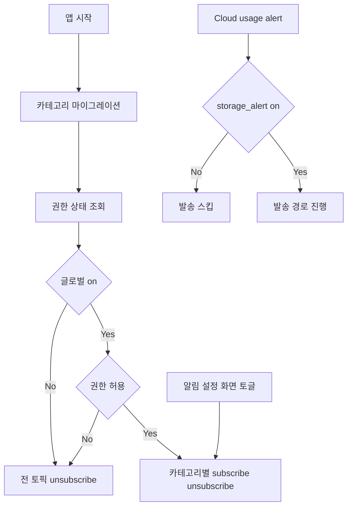

# Notifications Phase 2A 계획 v1

## 목표
- 카테고리별 수신 설정 도입
- FCM 토픽을 카테고리 단위로 분리
- 기존 MVP 전체 스위치와 우선순위 규칙 정립

## 범위
- 카테고리
  - clip
  - project
  - promotion
  - storage_alert
- 기본값
  - clip=true
  - project=true
  - storage_alert=true
  - promotion=false

## 데이터 계약

### SharedPreferences 키
- 기존 유지
  - notification_permission_requested
  - notifications_enabled
- 신규
  - notifications_category_clip_enabled
  - notifications_category_project_enabled
  - notifications_category_promotion_enabled
  - notifications_category_storage_alert_enabled
  - notifications_category_migrated_v1

### 마이그레이션 규칙
- notifications_category_migrated_v1=false 또는 키 없음일 때 1회 실행
- notifications_enabled=false 이면 카테고리 값 저장은 기본값으로 하되 실제 수신은 글로벌 off 우선
- 기존 사용자 업그레이드 시 카테고리 기본값 적용
  - clip true
  - project true
  - storage_alert true
  - promotion false
- 완료 후 notifications_category_migrated_v1=true 저장

## 토픽 정책

### 토픽 네이밍
- three_sec_clip
- three_sec_project
- three_sec_promotion
- three_sec_storage_alert

### 동기화 규칙
- 글로벌 notifications_enabled=false 이면 전 카테고리 unsubscribe
- 글로벌 on + 권한 허용 시 카테고리별 bool=true 인 토픽만 subscribe
- 글로벌 on + 권한 비허용 시 전 카테고리 unsubscribe 유지
- 동기화 트리거
  - 앱 시작 시 1회
  - Notifications 화면 진입 시 1회
  - 글로벌 스위치 변경 즉시
  - 카테고리 스위치 변경 즉시
  - 앱 resume 시 권한 변화 감지 후 1회

## UI 정책

### 화면 구조
- 상단 카드
  - 권한 상태
  - 글로벌 스위치
- 카테고리 카드 목록
  - Clip 알림
  - Project 알림
  - 프로모션 알림
  - 저장공간 알림
- 하단
  - 시스템 설정 이동 버튼

### 우선순위 규칙
- 글로벌 off면 카테고리 스위치 UI는 비활성 표시
- 카테고리 값은 유지하되 적용은 글로벌 on에서만 활성
- 글로벌 on 전환 시 권한 notDetermined면 권한 요청
- 권한 denied면 설정 이동 유도 스낵바 유지

## Cloud usage alert 연동
- checkUsageAndAlert 에서 기존 글로벌 가드 유지
- 추가 가드
  - notifications_category_storage_alert_enabled=false 면 발송 스킵
- 향후 서버 발송 연동 시 storage_alert 토픽만 대상으로 사용

## 변경 대상 파일
- lib/services/notification_settings_service.dart
  - 카테고리 enum 또는 상수 추가
  - 카테고리별 get set API 추가
  - 전체 토픽 동기화 API를 카테고리 aware로 확장
  - 마이그레이션 API 추가
- lib/screens/notifications_screen.dart
  - 카테고리 스위치 UI 추가
  - 글로벌 off 상태 비활성 처리
  - 토글 이벤트별 동기화 호출 분리
- lib/main.dart
  - startup sync 전에 카테고리 마이그레이션 보장
  - startup sync 를 카테고리 기반으로 호출
- lib/services/cloud_service.dart
  - storage_alert 카테고리 가드 추가

## 구현 체크리스트
- 1 서비스 계층 확장
  - 카테고리 키 상수 정의
  - 기본값 맵 정의
  - migrateCategorySettingsIfNeeded 구현
  - syncCategoryTopics 구현
- 2 화면 확장
  - 카테고리 상태 로드
  - 글로벌 스위치 연동
  - 카테고리 스위치 이벤트 처리
- 3 앱 시작 경로 반영
  - main init 에 migrate 후 sync 호출
- 4 Cloud 연동
  - storage_alert 카테고리 체크 추가
- 5 회귀 검증
  - 기존 MVP 동작 유지 확인

## 검증 시나리오
- 시나리오 A 최초 사용자
  - 글로벌 on
  - clip vlog storage_alert subscribe
  - promotion unsubscribe
- 시나리오 B 기존 MVP 사용자 업그레이드
  - 마이그레이션 1회 실행
  - 카테고리 기본값 생성
- 시나리오 C 글로벌 off
  - 전 토픽 unsubscribe
  - 카테고리 값 유지
- 시나리오 D 글로벌 on + promotion on
  - promotion 토픽 subscribe 반영
- 시나리오 E 권한 denied
  - subscribe 없음 유지
  - 설정 이동 안내 노출
- 시나리오 F storage_alert off
  - Cloud 고용량 경고 시 발송 스킵

## 흐름도

