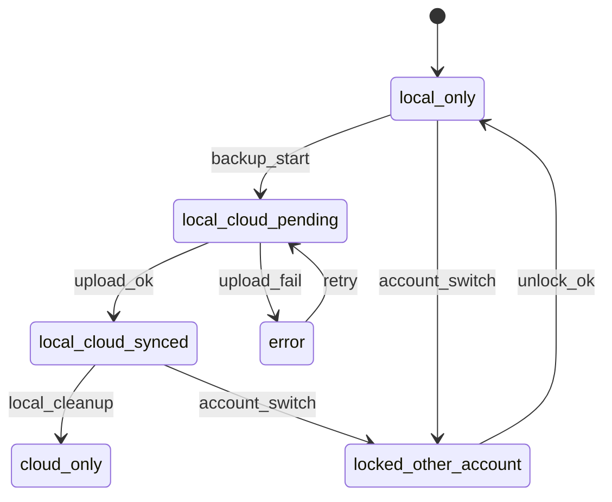

# 3s Android Flutter Local Cloud 정책 출시 계획서 v1

## A. 결정 문서 Decision Doc

### A-1. 최종 권장 정책 1안
- 권장안: 하이브리드 정책
  - 기본값: 로그아웃 시 로컬 데이터 유지
  - 계정 전환 시: 이전 계정 소유 로컬 항목은 새 계정에서 잠금 상태로 표시
  - 선택지: 잠금 해제, 현재 계정으로 가져오기, 기기에서 삭제

- 이 안이 유리한 이유
  - 매출: Free 사용자도 로컬 제작 경험을 잃지 않아 앱 이탈 감소, Standard 업그레이드 시 즉시 백업 제안 가능
  - 신뢰: 데이터가 사라지지 않는다는 안정감 제공, 동시에 타인 계정에서 바로 노출되지 않아 프라이버시 신뢰 확보
  - CS: 로그아웃 후 영상 소실 문의와 계정 전환 후 타인 데이터 노출 문의를 동시에 감소

### A-2. 로그아웃 계정 전환 시 로컬 데이터 처리 정책
- 기본 정책
  - 로그아웃 시 파일은 물리적으로 유지
  - 앱 재로그인 시 현재 계정 기준으로 라이브러리 렌더링
  - ownerAccountId가 현재 계정과 다르면 잠금 표시

- 사용자 선택지
  - 로그아웃 다이얼로그 고급 옵션
    - 로컬 유지 기본
    - 이 기기에서 내 로컬 데이터 삭제
    - 이 기기에서 내 로컬 데이터 잠금 강제

- 잠금 동작
  - 잠금 항목은 썸네일 저해상도 블러 미리보기만 허용
  - 편집 내보내기 공유 삭제는 차단
  - 잠금 해제는 기기 인증 핀 또는 생체 인증 후 가능

### A-3. Free에서 Standard 업그레이드 순간 안내 마이그레이션
- 트리거
  - 결제 성공 직후
  - 또는 첫 클라우드 진입 시

- UX 단계
  1. 축하 배너: 클라우드 백업 사용 가능
  2. 1차 제안 바텀시트: 지금 로컬을 클라우드에 백업하시겠어요
  3. 옵션
     - 지금 백업
     - WiFi에서 자동 백업
     - 나중에
  4. 결과 요약: 업로드 대기, 진행중, 실패 수

- 기본값
  - Standard 이상은 자동 업로드 On
  - 모바일 데이터 업로드 Off

---

## B. UX 스펙 화면별

### B-1. Library 화면
- 상단 필터 탭
  - 전체
  - 기기
  - 클라우드
  - 잠금

- 카드 배지 규칙
  - 기기 전용: 기기
  - 동기화 완료: 동기화됨
  - 동기화 대기: 업로드 대기
  - 오류: 동기화 오류
  - 클라우드 전용: 클라우드 전용
  - 다른 계정 소유: 잠김

- 빈 상태
  - 전체 빈 상태: 아직 클립이 없어요. 촬영하거나 가져오기를 시작해보세요
  - 클라우드 탭 빈 상태 Free: 클라우드 백업은 Standard에서 사용 가능
  - 클라우드 탭 빈 상태 Standard: 아직 업로드된 클립이 없어요

- 메타 정보 표기
  - 저장 위치: 기기 클라우드 혼합
  - 백업 상태: 완료 대기 오류
  - 마지막 동기화 시간

### B-2. Vlog 화면
- 프로젝트도 동일 분류 적용
  - 기기 프로젝트
  - 동기화 프로젝트
  - 클라우드 전용 프로젝트 선택 허용

- 카드 메타
  - 원본 참조 상태: 원본 로컬 필요, 원본 다운로드됨
  - 편집 가능 여부: 즉시 편집 가능, 다운로드 필요
  - 마지막 편집 기기

- Cloud only 편집 정책
  - 프로젝트 열기 시 필요한 원본 없으면 다운로드 플로우로 유도
  - 부분 다운로드 지원: 타임라인에서 선택된 클립 우선 다운로드

### B-3. Profile 화면
- 노출 항목
  - 현재 플랜 Free Standard Premium
  - 클라우드 사용량 3.2GB / 10GB
  - 동기화 상태 칩
    - 대기 3
    - 업로드중 2
    - 오류 1
    - 완료

- 설정 액션
  - 로그아웃 시 로컬 처리 기본값 설정
  - 잠금 해제 방식 설정 생체 핀
  - 클라우드 자동 업로드 WiFi only

### B-4. Paywall 화면
- 기능 잠금 업셀 원칙
  - 진행중 작업 차단 최소화
  - 즉시 결제 강요 대신 저장 대안 제공

- 예시
  - Free 사용자가 클라우드 저장 선택 시
    - 카피: 이 항목은 기기에 저장되고 있어요. 클라우드 백업을 켜면 기기 분실에도 안전해요
    - CTA1: Standard 시작
    - CTA2: 기기에 계속 저장

### B-5. 마이크로카피 예시
- 저장 완료 기기: 이 클립은 이 기기에만 저장돼요
- 동기화 대기: 네트워크 연결 시 자동 업로드됩니다
- 동기화 오류: 업로드에 실패했어요. 네트워크를 확인하고 다시 시도하세요
- 잠금 항목: 다른 계정의 로컬 항목이에요. 잠금 해제 후 사용할 수 있어요

---

## C. 상태 머신 State Machine

### C-1. Clip 상태
- local_only
- local_cloud_pending
- local_cloud_synced
- cloud_only
- error
- locked_other_account

### C-2. Project 상태
- project_local_only
- project_local_cloud_pending
- project_local_cloud_synced
- project_cloud_only_manifest
- project_error
- project_locked_other_account

- 프로젝트 편집 메타 정책
  - 로컬에 editMeta를 항상 유지
  - 클라우드에는 projectManifest와 필요한 파생 메타 업로드
  - cloud_only 프로젝트는 편집 진입 전 editMeta 임시 로컬 생성

### C-3. 전이 조건
- 업로드 성공: local_cloud_pending -> local_cloud_synced
- 업로드 실패: local_cloud_pending -> error
- 재시도 성공: error -> local_cloud_synced
- 오프라인 진입: 업로드 작업은 pending 유지
- 계정 변경
  - owner 불일치 로컬 항목: any -> locked_other_account
- 잠금 해제 인증 성공
  - locked_other_account -> local_only 또는 local_cloud_synced
- 구독 다운그레이드 Standard to Free
  - 신규 저장 목적지는 local_only 강제
  - 기존 synced 항목은 조회 허용, 신규 클라우드 업로드 차단

---

## D. 데이터 저장 구조 Flutter Android 관점

### D-1. 로컬 저장 위치 및 디렉토리
- 앱 전용 저장소 기반
  - files/vlogs/raw_clips/{album}/{clipId}.mp4
  - files/vlogs/projects/{projectId}.json
  - files/vlogs/edit_meta/{projectId}.json
  - files/vlogs/cache/cloud/{clipId}.mp4

- 파일 네이밍
  - clipId: ULID 또는 timestamp+rand
  - projectId: UUID
  - 충돌 회피를 위해 원본 파일명 비의존

### D-2. DB 스키마 제안 최소
- clips
  - id
  - albumId
  - ownerAccountId nullable
  - localPath nullable
  - cloudKey nullable
  - storageClass local cloud hybrid
  - syncState
  - lockState
  - checksum
  - createdAt
  - updatedAt

- projects
  - id
  - ownerAccountId nullable
  - title
  - clipRefs json
  - editMetaPath nullable
  - cloudManifestKey nullable
  - syncState
  - lockState
  - createdAt
  - updatedAt

- sync_jobs
  - id
  - entityType clip project
  - entityId
  - action upload download delete
  - attemptCount
  - nextRetryAt
  - lastErrorCode
  - lastErrorMessage
  - createdAt

### D-3. 계정별 분리 선택 시와 비선택 시 차이
- 본 권장안 하이브리드
  - 물리 파일 공용 보관
  - 메타 ownerAccountId와 lockState로 논리 분리
  - 장점: 마이그레이션 비용 낮음

- 계정 완전 분리 대안
  - files/vlogs/users/{uid}/...
  - 장점: 프라이버시 강함
  - 단점: 계정 전환 시 중복 저장 복사 비용 큼

### D-4. 구독 플랜 계정 변경 시 마이그레이션 가비지 컬렉션
- 업그레이드
  - local_only 배치 스캔 후 업로드 큐 등록
- 다운그레이드
  - 자동 업로드 중단
  - 기존 cloud 데이터는 보존 읽기전용
- 계정 변경
  - lockState 재계산
  - 사용자 선택에 따라 ownership reassignment 수행
- GC
  - cloud_only 캐시는 LRU 기반 삭제
  - error 상태 30일 경과 항목은 사용자 확인 후 정리

---

## E. 동기화 설계 Sync

### E-1. 업로드 트리거
- 자동
  - 클립 생성 완료
  - 프로젝트 저장 완료
  - 앱 포그라운드 복귀 시 pending 재개
- 수동
  - 카드 액션 백업
  - 프로필 전체 백업

- 옵션
  - WiFi only
  - 배터리 절약 모드에서는 대용량 업로드 지연

### E-2. 충돌 처리
- 동일 파일 판정
  - checksum + duration + createdAt 근사 비교
- 동일 프로젝트 이름
  - 서버 저장 키는 projectId 기준, 이름 충돌 무시
- 중복 업로드 방지
  - sync_jobs unique entityType + entityId + action

### E-3. 재시도 실패 UI 사용자 행동
- 재시도
  - exponential backoff with jitter
  - 최대 횟수 도달 시 error 고정 후 사용자 액션 대기

- 실패 UI 규칙
  - 원인 + 행동 포함
  - 예시: 네트워크가 불안정해 업로드에 실패했어요. WiFi 연결 후 재시도 버튼을 눌러주세요

- 사용자 액션
  - 재시도
  - 모바일 데이터로 진행
  - 취소

### E-4. 오프라인 접근 정책
- cloud_only 항목
  - 프리뷰 썸네일은 캐시 사용
  - 편집 또는 내보내기 시 원본 다운로드 필요
- 다운로드 정책
  - 최근 연 항목 자동 캐시
  - 저장공간 부족 시 오래된 캐시부터 삭제

---

## F. 보안 개인정보 공유기기 리스크 대응

### F-1. 공유기기 로컬 노출 대응
- 로그아웃 시 선택 제공
  - 로컬 유지 기본
  - 로컬 삭제
  - 로컬 잠금

- 기본 추천
  - 로컬 유지 + 잠금 자동 적용
  - 이유: 데이터 보존성과 프라이버시 균형

### F-2. 계정 삭제 데이터 삭제 플로우
- 앱 내 사용자 통제 플로우
  1. 계정 삭제 진입
  2. 삭제 범위 안내 계정 프로필 구독 클라우드 데이터
  3. 로컬 데이터 처리 선택
     - 이 기기 로컬도 삭제
     - 이 기기 로컬 유지 잠금
  4. 최종 확인 후 실행
  5. 결과 리포트 표시

---

## G. 테스트 플랜 릴리즈 게이트 포함

### G-1. P0 시나리오
- 계정 전환
  - A 계정 로컬 생성 -> 로그아웃 -> B 로그인 -> 잠금 노출 확인
- 업그레이드 후 백업
  - Free 로컬 100개 -> Standard 업그레이드 -> 배치 업로드 성공률
- 오프라인
  - cloud_only 항목 오프라인 진입 시 안내 정확성
- 저장공간 부족
  - 다운로드 중 부족 발생 시 캐시 정리와 사용자 안내
- 내보내기 실패 복구
  - 원인 메시지와 재시도 동선 검증

### G-2. 성공 지표
- export_success_rate
- sync_fail_rate
- crash_free_sessions
- account_switch_confusion_rate 고객문의 기반

### G-3. 절대 출시 금지 조건 제안
- export_success_rate 98 미만
- sync_fail_rate 3 초과
- account_switch에서 타 계정 잠금 미적용 1건 이상 재현
- 치명 크래시가 동기화 경로에서 재현 가능

---

## H. 작업 분해 WBS + 티켓 목록

### H-1. 구현 티켓 22개

1. 계정 전환 정책 플래그 정의
- 목적: 하이브리드 정책 중앙 설정
- 변경 파일 추정: lib/services/auth_service.dart, lib/managers/video_manager.dart
- AC: 로그아웃 정책값 읽기 쓰기 가능
- 우선순위: P0

2. 클립 메타 ownerAccountId lockState 필드 추가
- 목적: 논리 분리 기반 마련
- 변경 파일 추정: lib/managers/video_manager.dart
- AC: 신규 클립 저장 시 owner 반영
- 우선순위: P0

3. 프로젝트 메타 ownerAccountId lockState 추가
- 목적: 프로젝트 잠금 통제
- 변경 파일 추정: lib/models/vlog_project.dart, lib/managers/video_manager.dart
- AC: 저장 로드 시 필드 유지
- 우선순위: P0

4. 로컬 인덱스 저장소 도입
- 목적: 파일 시스템 스캔 의존 완화
- 변경 파일 추정: lib/services/local_index_service.dart 신규
- AC: clips projects 조회 API 제공
- 우선순위: P0

5. 로그아웃 다이얼로그 고급 옵션 UX
- 목적: 유지 삭제 잠금 선택 제공
- 변경 파일 추정: lib/screens/profile_screen.dart
- AC: 선택값 저장 및 signOut 파이프 연결
- 우선순위: P0

6. 계정 로그인 시 잠금 재계산
- 목적: 계정 불일치 데이터 자동 잠금
- 변경 파일 추정: lib/services/auth_service.dart, lib/managers/video_manager.dart
- AC: B 계정 로그인 시 A 데이터 잠금
- 우선순위: P0

7. Library 상단 필터 전체 기기 클라우드 잠금
- 목적: 저장 위치 가시성
- 변경 파일 추정: lib/screens/library_screen.dart
- AC: 필터별 목록 정확
- 우선순위: P0

8. Library 카드 배지 컴포넌트 추가
- 목적: 상태 인지성 강화
- 변경 파일 추정: lib/widgets/media_widgets.dart
- AC: 6개 상태 배지 노출
- 우선순위: P0

9. Vlog 카드 메타 저장 위치 참조상태 추가
- 목적: 편집 전 제약 안내
- 변경 파일 추정: lib/screens/vlog_screen.dart, lib/widgets/media_widgets.dart
- AC: 다운로드 필요 상태 명확 표시
- 우선순위: P0

10. Profile 동기화 상태 집계 노출
- 목적: 신뢰성 피드백
- 변경 파일 추정: lib/screens/profile_screen.dart, lib/services/cloud_service.dart
- AC: 대기 업로드중 오류 완료 수치 표시
- 우선순위: P0

11. Paywall 비차단 업셀 카피 개선
- 목적: 짜증 최소화
- 변경 파일 추정: lib/screens/paywall_screen.dart
- AC: 클라우드 잠금 시 대체 저장 CTA 제공
- 우선순위: P1

12. 업그레이드 직후 백업 제안 바텀시트
- 목적: 전환 직후 활성화
- 변경 파일 추정: lib/services/iap_service.dart, lib/main.dart
- AC: 구매 성공 후 1회 노출
- 우선순위: P0

13. 자동 업로드 트리거 확장
- 목적: pending 자동 소진
- 변경 파일 추정: lib/services/cloud_service.dart
- AC: 생성 저장 앱복귀 트리거 동작
- 우선순위: P0

14. sync_jobs 큐 영속화
- 목적: 앱 재시작 내구성
- 변경 파일 추정: lib/services/cloud_service.dart, lib/services/sync_queue_store.dart 신규
- AC: 재시작 후 큐 복원
- 우선순위: P0

15. 재시도 백오프 지터 도입
- 목적: 실패 복원력
- 변경 파일 추정: lib/services/cloud_service.dart
- AC: 백오프 스케줄 로그 검증
- 우선순위: P0

16. 에러 메시지 템플릿 원인+행동 통일
- 목적: CS 감소
- 변경 파일 추정: lib/utils/error_copy.dart 신규, 관련 화면
- AC: 주요 실패 케이스 모두 규칙 준수
- 우선순위: P0

17. cloud_only 오프라인 프리뷰 캐시 레이어
- 목적: 오프라인 사용성
- 변경 파일 추정: lib/services/cloud_service.dart, lib/managers/video_manager.dart
- AC: 썸네일 프리뷰 유지
- 우선순위: P1

18. 다운로드 필요 시 편집 진입 가드
- 목적: 실패 예방
- 변경 파일 추정: lib/screens/video_edit_screen.dart
- AC: 원본 미존재 시 다운로드 유도
- 우선순위: P0

19. 계정 삭제 플로우 로컬 처리 선택 추가
- 목적: 사용자 통제 강화
- 변경 파일 추정: lib/screens/profile_screen.dart, lib/services/auth_service.dart
- AC: 삭제 후 로컬 처리 선택 반영
- 우선순위: P1

20. 관측 지표 로깅 추가
- 목적: 출시 게이트 측정
- 변경 파일 추정: lib/services/analytics_service.dart 신규, 주요 이벤트 지점
- AC: 핵심 KPI 이벤트 수집
- 우선순위: P0

21. P0 통합 QA 시나리오 자동화 스크립트
- 목적: 회귀 방지
- 변경 파일 추정: tools/android_capture_session.cmd, plans/android_qa_journey_release_gate_v1.md
- AC: 계정전환 업그레이드 오프라인 케이스 자동 실행 가능
- 우선순위: P1

22. 릴리즈 게이트 대시보드 체크리스트
- 목적: 출고 판정 표준화
- 변경 파일 추정: plans/android_qa_journey_release_gate_v1.md
- AC: 금지 조건 자동 체크 항목 반영
- 우선순위: P0

### H-2. 역할 분리 체크리스트

- Roo Code 설계 검토 체크
  - 정책 일관성 검증
  - 상태 머신과 DB 스키마 정합성 검증
  - 에러 카피 원인+행동 규칙 검수
  - 릴리즈 게이트 충족 여부 최종 승인

- Codex 구현 체크
  - 티켓 단위 코드 구현
  - 단위 테스트 및 통합 테스트 추가
  - UI 상태 배지 필터 동작 검증
  - 로그와 분석 이벤트 삽입

---

## 부록: 현 코드와의 연결 포인트
- 로그아웃 시 사용자 종속 캐시 초기화 로직이 이미 존재하며 확장 필요
- 클라우드 동기화 서비스와 업로드 큐가 있어 sync_jobs 영속화 중심으로 고도화 가능
- Library Vlog Profile Paywall 화면이 분리되어 있어 상태 배지 및 필터 적용이 용이

