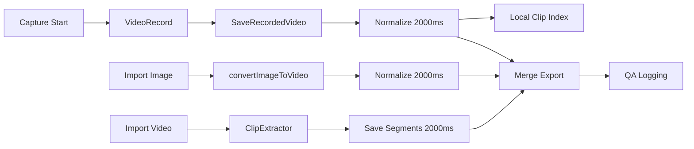

# 2초 정책 전환 설계안 v1

## 1) 결론 요약

- **실제 처리 길이 정책**: `2000ms`
- **UI 라벨 정책**: `2s`로 명시 변경
- **정규화 전략**: 초과 길이 소스는 2초 구간으로 축소(또는 최대 2초 보존), 짧은 소스는 원본 길이 유지
- **Flutter ↔ Native 계약**: `targetDurationMs`(ms) 중심 계약으로 통일, 실패 코드/상태를 계약 스키마로 기록

> 기존 전환 설계 문서(`plans/one_point_five_sec_transition_plan_v1.md`)와 다수 테스트 문서는 실제/표시 분리가 명확하나 라벨을 2s로 변경해야 하므로 새 계획 기준으로 재작성이 필요함.

---

## 2) 정책 적용 전제

1. 단일 소스 상수로 길이 정책을 관리
   - 실제 정책: `kTargetClipMs`
   - 노출 라벨: `kTargetClipSecForDisplay`

2. Flutter와 Native의 단위는 ms를 기본으로 유지하고, UI 표시는 초 단위

3. `targetDurationMs <= 0`은 유효하지 않은 입력으로 간주하고 Native에서 실패 처리

---

## 3) 경로별 정책 전환 규칙 (현행 대비 변경안)

### 3.1 촬영 흐름 (`capture_screen` → `video_manager`)

| 단계 | 현재(근거) | 2초 전환 규칙 |
|---|---|---|
| 기록 타이머 트리거 | `kTargetRecordingMilliseconds = kTargetClipMs`, 종료 트리거 `target + safety` | `kTargetClipMs`를 `2000`로 상향. 타이머 루프는 동일 로직 유지 | 
| 카운트다운 표시 | `_remainingTime = kTargetClipSecForDisplay` | 표시 상수도 `2`로 변경 | 
| 저장 전 정규화 | `_normalizeRecordedVideo(video.path, currentPath)` 항상 실행 | `targetDurationMs=2000`, `trimMode=center` 그대로 유지 | 

- 촬영 흐름 근거: [`_targetRecordingMilliseconds`](lib/screens/capture_screen.dart:71), [`_remainingTime`](lib/screens/capture_screen.dart:70), [`_targetClipMs`](lib/constants/clip_policy.dart:1), [`_startRecordingTimer`](lib/screens/capture_screen.dart:442), [`saveRecordedVideo`](lib/managers/video_manager.dart:2999).

### 3.2 이미지 가져오기/변환 (`main.dart` → `video_manager.convertPhotoToVideo`)

| 단계 | 현재(근거) | 2초 전환 규칙 |
|---|---|---|
| 이미지 선택 분기 처리 | `mediaType == image` 시 `convertPhotoToVideo(path, currentAlbum)` | 유지 |
| Native 호출 인자 | `duration`에 `kTargetClipMs` 기반 `(kTargetClipMs+999)/1000` 전달 | `duration` 산출식 자체 유지. `kTargetClipMs=2000`이면 `2` 전달 |
| 정규화 단계 | `normalizeVideoDuration` 호출 | `targetDurationMs=2000`, center trim 기본 |

- 근거: [`convertPhotoToVideo` 호출부](lib/main.dart:1865), [`video_manager.convertPhotoToVideo` 요청 파라미터](lib/managers/video_manager.dart:1731), [`normalizeRecordedVideo_request`](lib/managers/video_manager.dart:2990).

### 3.3 동영상 가져오기/구간 추출 (`clip_extractor_screen`)

| 단계 | 현재(근거) | 2초 전환 규칙 |
|---|---|---|
| 기본 고정 구간 길이 | `_fixedWindowMs = kTargetClipMs` | `kTargetClipMs`를 2000으로 반영하여 자동 전이 |
| 구간 시작 보정 | `startMs > total - kTargetClipMs` 보정 | 보정식을 유지, 비교 임계치가 2000으로 적용 |
| 구간 저장 payload | `end = start + kTargetClipMs` | 동작 동일(상수값만 2000 적용) |
| 클립 리스트 duration | `durationMs: kTargetClipMs` | 동일하게 2000 반영 |

- 근거: [`_fixedWindowMs`](lib/screens/clip_extractor_screen.dart:32), [`_addCurrentSegment` 보정](lib/screens/clip_extractor_screen.dart:221), [`추출 페이로드 생성`](lib/screens/clip_extractor_screen.dart:509), [`durationMs 설정`](lib/screens/clip_extractor_screen.dart:560).

### 3.4 편집 흐름 (`trim_editor_modal`, `video_edit_screen`)

- `trim_editor_modal`은 기존 고정 ms 하드코딩 제거 대상이었으며, 현재는 정책 상수 공유로 정렬.
- 동적 trim 화면(`video_edit_screen`)은 fallback이 정책 상수 사용 중이므로 표시/로직 정합 유지.

| 단계 | 현재(근거) | 2초 전환 규칙 |
|---|---|---|
| 고정 구간 루프 윈도우 | `static const double _fixedWindowMs = kTargetClipMs.toDouble()` | 정책 상수 공유 유지 |
| duration fallback | `kTargetClipMs` | 2000 반영 |

- 근거: [`_fixedWindowMs`](lib/widgets/trim_editor_modal.dart:46), [`duration fallback`](lib/screens/video_edit_screen.dart:479), [`maxMs fallback`](lib/screens/video_edit_screen.dart:1887).

### 3.5 내보내기/합성 흐름 (`exportVlog`)

- 현재 내보내기 흐름은 선택 clip들의 `start/end` 기준으로 총 길이를 집계.
- 2초 전환은 기존 동작 유지(개별 clip metadata가 2초 기준이므로 합성 총 길이 반영 자동 변화).

- 근거: [`totalDurationMs 집계`](lib/managers/video_manager.dart:2862), clip 단위 duration 기반 계산.

---

## 4) Dart ↔ Native MethodChannel 계약 초안

### 4.1 호출 표준

#### `convertImageToVideo`

- **Call**: `platform.invokeMethod('convertImageToVideo', {...})`
- **입력**
  - `imagePath: String`
  - `outputPath: String`
  - `duration: int` (**초 또는 ms 가능** — Native는 <=1000이면 초로 간주 후 ms 변환)
- **권장 출력**: `String` (`SUCCESS`)
- **오류 코드(기대값)**: Flutter에서는 message string으로 전달 실패

근거: [`VideoManager 호출`](lib/managers/video_manager.dart:1737), [`MainActivity 파싱 규칙`](android/app/src/main/kotlin/com/dk/three_sec/MainActivity.kt:529).

#### `normalizeVideoDuration`

- **Call**: `platform.invokeMethod('normalizeVideoDuration', {...})`
- **입력**
  - `inputPath: String`
  - `outputPath: String`
  - `targetDurationMs: int`
  - `trimMode: String` (`start` 또는 `center`)
- **권장 입력 규칙**
  - `targetDurationMs <= 0` → Dart에서 호출하지 않거나 바로 fail 처리
  - `trimMode` 미기재 시 Flutter 기본 `center`
- **출력**: `SUCCESS` or throw
- **Native 실패 코드(예시)**
  - Android: `INVALID_ARGS`, `INVALID_SOURCE_DURATION`, `NORMALIZE_FAILED`, `NORMALIZE_SETUP_FAILED`
  - iOS: `INVALID_SOURCE_DURATION`, `INVALID_SOURCE`, `INSERT_ERROR`, `EXPORT_FAILED`

근거: [`normalizeRecordedVideo 요청`](lib/managers/video_manager.dart:3000), [`MainActivity 구현`](android/app/src/main/kotlin/com/dk/three_sec/MainActivity.kt:630), [`AppDelegate 구현`](ios/Runner/AppDelegate.swift:126).

#### `getVideoDurationMs`

- **Call**: `platform.invokeMethod('getVideoDurationMs', {'inputPath': ...})`
- **출력**: `int` 또는 `String`/`num` fallback 허용
- **실패 코드**: `INPUT_NOT_FOUND`, `DURATION_FAILED`

근거: [`_getVideoDurationMsNative`](lib/managers/video_manager.dart:2964), [`getVideoDurationMs`](android/app/src/main/kotlin/com/dk/three_sec/MainActivity.kt:597).

### 4.2 실패/오류 처리 방침

- Dart는 Native 실패를 `normalize 실패`, `convert 실패`, `duration 조회 실패`로 구분 로깅
- Native가 `FAIL` 시 Flutter는 실패 원인 및 로그를 보존하고 fallback을 수행
  - 저장: `copy` fallback (`saveRecordedVideo`) 유지
  - 이미지 변환: convert/normalize 실패 시 상위 흐름에서 항목 fail로 전이
- 에러 모드 식별 필드
  - `step`: capture|photo_to_video|normalize|duration_query|extract|edit|merge
  - `platformError`: 에러 코드
  - `sourceDurationMs`/`targetDurationMs`/`normalizedDurationMs` 등 지표 보존

근거: [`saveRecordedVideo fallback`](lib/managers/video_manager.dart:2930), [`normalizeRecordedVideo fallback catch`](lib/managers/video_manager.dart:3012).

---

## 5) 계산식 및 엣지케이스

### 5.1 길이 정규화 계산식

```text
effectiveTargetMs = clamp(kTargetClipMs, >=200)
sourceDurationMs = media duration

clipMs = min(sourceDurationMs, effectiveTargetMs)
if trimMode == center and sourceDurationMs > clipMs:
  startMs = (sourceDurationMs - clipMs) / 2
else:
  startMs = 0
endMs = startMs + clipMs
```

- 현재 Android의 `normalizeVideoDuration`는 위 공식(`clipMs`, `startMs`, `endMs`)을 그대로 사용.
- iOS의 `normalizeVideoDuration`은 현재 `safeTargetDurationMs`를 사용해 `timeRange`로 반복/반복복제 후 출력.

근거: Android 공식 [`min(sourceDurationMs, targetDurationMs)` 및 trim 계산](android/app/src/main/kotlin/com/dk/three_sec/MainActivity.kt:664), iOS 반복 복제 로직 및 `timeRange` 설정([`ios/Runner/AppDelegate.swift:158](ios/Runner/AppDelegate.swift:159)).

### 5.2 2초 초과 시 구간 선택 + 최대 길이 보존 규칙

- 2초 초과 영상: `clipMs=2000` 설정
- 동영상 추출/저장 결과는 2초 또는 디코더/컨테이너 영향으로 미세한 편차 허용
- 수동 구간 선택 화면(`clip_extractor_screen`)에서는 기본 윈도우 길이를 2초로 고정하고 시작점은 사용자 제어

### 5.3 엣지케이스

1. **sourceDurationMs <= 0**
   - Native 실패 처리 및 Dart 로그
2. **duration 미존재/0 전달**
   - Dart 기본값으로 `2000` 강제는 금지. 최소 유효성 검사 후 호출
3. **짧은 클립(<2000ms)**
   - 클립 길이 유지(normalize 없이도 완료 가능) 또는 최소 길이 미만 그대로 유지 후 로그
4. **trim range 음수/역전**
   - `start/end` 계산 clamp 및 보정으로 방어
5. **iOS 이미지 변환 미구현**
   - Android만 이미지→비디오가 실제 동작, iOS는 호출 실패를 명시적으로 잡아 fallback/큐 분기 필요

근거: iOS 미구현 여부 [`call handler`](ios/Runner/AppDelegate.swift:55), Android `convertImageToVideo` 존재.

---

## 6) 공통 상수/하드코딩 분리 체크포인트

### 6.1 즉시 수정 대상(분석 기준)

1. [`lib/widgets/trim_editor_modal.dart`](lib/widgets/trim_editor_modal.dart)
   - `static const double _fixedWindowMs = kTargetClipMs.toDouble()`로 정책 상수 공유
   - 2초 정책 변경 시 `kTargetClipMs` 단일 변경으로 동기화

2. 라벨 문자열군의 상수화
   - 표시 라벨 분기에서 숫자 리터럴 `1` 사용 제거
   - 권고: `kTargetClipSecForDisplay`만 참조

3. 상수 일치성 점검 목록
   - `clip_policy.dart`
   - Android `DEFAULT_TARGET_DURATION_MS`
   - iOS `DEFAULT_TARGET_DURATION_MS`
   - Dart 인서트(`kTargetClipMs`)

### 6.2 구현 시점 동기화 순서(권고)

- 1단계: 상수 일원화 문서 승인(`clip_policy.dart`, Android/iOS 기본값)
- 2단계: UI 하드코딩 제거(`trim_editor_modal`)
- 3단계: QA 가드 적용

---

## 7) QA/KPI/리스크/롤백

### 7.1 실행 QA 항목

- 촬영 10회 연속: `normalizedDurationMs` 평균/최대/최소가 2000ms 허용 오차 내
- 이미지 가져오기 20건: 변환 결과 `normalizedDurationMs`가 2000ms 근처 여부
- 동영상 가져오기 20건: 1개씩 추출 시 segment duration 2000ms
- `1.5초` 라벨 오차 체크가 아니라 **`2s` 라벨 정확성** 체크로 교체
- `targetDurationMs`/`normalizedDurationMs` mismatch 비율 수집

### 7.2 KPI 권고

- 길이 정합성: `abs(normalizedDurationMs - 2000) <= 120` 비율
- 라벨 오차: 라벨 노출값(`2s`) 대비 실제 평균 편차 로그 미스매치 0
- 채널 실패율: `convertImageToVideo`, `normalizeVideoDuration` 호출 실패율 1% 이하(P0 gate 조건은 정책에서 별도 수립)

### 7.3 롤백 전략

- 정책 스위치: `kTargetClipMs` 단일 상수 변경으로 빠른 되돌림
- 실패 임계 초과 시 24시간 내 긴급 롤백 체크리스트
  - Native 호출 실패율 상승
  - 구간 seek/jitter 증상 증가
  - 내보내기/병합 실패율 증가

### 7.4 리스크 로그맵(요약)

- `Android`: `normalize failed` 급증
- `iOS`: `convertImageToVideo` 미구현 지속 + normalize path loop 구성 이슈
- `Trim UX`: 루프 seek 오차(라벨-실제) 증가

---

## 8) 단계별 실행 체크리스트(문서화 기준)

### Design
- [ ] 라벨 변경 범위(`1s -> 2s`) 확정
- [ ] `kTargetClipMs=2000`, `kTargetClipSecForDisplay=2` 제안 승인
- [ ] Native 기본값(`DEFAULT_TARGET_DURATION_MS`) 동기화

### Implementation Gate
- [ ] `trim_editor_modal` 고정 윈도우가 `kTargetClipMs`를 참조하는지 확인
- [ ] `AppDelegate`/`MainActivity` 폴백 로그 키 업데이트
- [ ] MethodChannel 입력 검증 강화

### QA Gate
- [ ] `duration` KPI 2초 기준 재계측
- [ ] 라벨·표시 정합성 검증
- [ ] 취소/재시도 시나리오 점검

### Release Gate
- [ ] 릴리즈 노트에 라벨 정책(`2s`)과 실제 길이 정책(`2000ms`) 동시 기재
- [ ] 72시간 모니터링 후 정식 반영

---

## 9) Mermaid: 전환 흐름 개요



---

## 10) 다음 조치

본 문서 기준으로 **라벨을 2s로 통일**한 상태에서 코드 변경 설계를 진행할 수 있습니다.
사용자 확인 후 다음 단계로 넘어가 1) `trim_editor_modal` 상수 공유, 2) 2초 라벨 반영 항목(문구/토스트/체크리스트) 수정 3) MethodChannel 계약 기반 QA 로그맵 보강을 수행할 수 있습니다.
